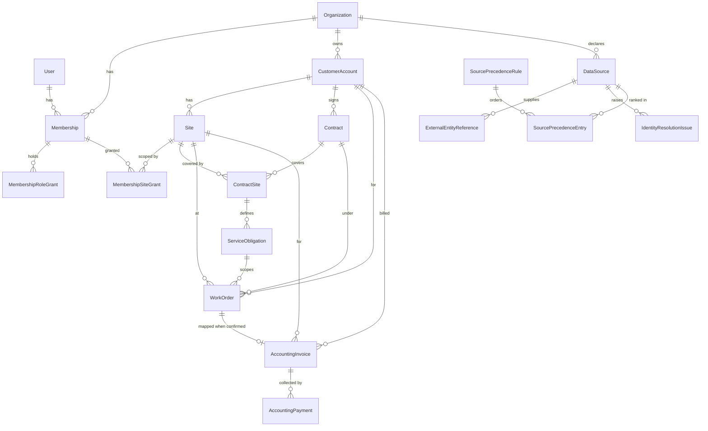

# Data dictionary — OpsRecovery V2

Scope: **Phase 4**. Thirty-four models across five apps. Every tenant-owned model carries
a UUID primary key, a non-null `organization`, and timezone-aware `created_at` /
`updated_at` from `apps.common.models.TenantScopedModel`; those four fields are not
repeated per model below.

`tests/test_data_dictionary.py` fails if a model exists without an entry here, so this
file cannot drift from the migrations.

## Route B scope

| Built | Deliberately absent (no placeholder) |
|---|---|
| Tenancy, RBAC, site grants | `Worker`, `Shift`, `TimeEntry`, `WorkerAvailabilityWindow` |
| Customer → Site → Contract → ContractSite → ServiceObligation | `QualificationType`, `SiteRequirement`, `WorkerQualification`, `WorkerSiteAuthorization` |
| `WorkOrder`, `AccountingInvoice`, `AccountingPayment` | `QualityEvent`, `SiteOperationalRule` |
| Source identity and reconciliation primitives | `Worker`, `Shift`, `TimeEntry`, `QualityEvent` and friends (Journeys A and C) |
| CSV import: `ImportBatch`, `ImportCoverage`, `ImportRow`, `SourceRecordVersion`, `ReconciliationRun` | `RecommendationSet`, `CandidateAssessment`, `Approval`, `ProposedAction` (Phase 5 — skipped under Route B) |
| Detection: `DetectorDispatchIntent`, `DetectorRun`, `DetectorScheduleLease`, `ExceptionCase`, `ExceptionSourceLink`, `ExceptionEvent`, `FinancialImpactSnapshot`, `FinancialRecoveryItem`, `AuditEvent` | `EvidenceArtifact` — evidence expansion |
| Recovery (Phase 6): `Approval`, `FinanceExport`, `FinancialStageEvent` | `RecommendationSet`, `ProposedAction`, draft handoff — Journeys A and C |

`SiteOperationalRule` is omitted because every one of its fields is an attendance or
quality input; the revenue detector's delay comes from
`ServiceObligation.uninvoiced_delay_days`.

## Entity relationships

The accounting source does not know what a work order is: `AccountingInvoice.work_order`
is nullable and set only when a confirmed crosswalk resolves to exactly one. Ordinary
reconciliation runs on confirmed customer/site references plus `service_date`.

## `organizations`

### `User` — `organizations_user`
Platform login identity. No organization field: tenancy is expressed through
memberships.

| Field | Type | Notes |
|---|---|---|
| `email` | EmailField, unique | Login identity, normalized to lowercase on every save |
| `display_name` | CharField(150) | |
| `is_active` | Boolean | |
| `is_staff` | Boolean | **Platform** administration. Never granted through tenant UI |
| `date_joined` | DateTime | |

### `Organization` — `organizations_organization`
A tenant.

| Field | Type | Notes |
|---|---|---|
| `slug` | SlugField(64), unique | Globally unique; immutable after deployment |
| `display_name` | CharField(200) | |
| `default_timezone` | CharField(64) | Validated IANA identifier |
| `currency` | CharField(3) | `USD` only for now, but not a hidden assumption |
| `status` | Choice | `active` / `suspended` / `archived`. Only `active` permits any action |
| `demo_mode` | Boolean | Synthetic labelling only; never an auth bypass |

### `Membership` — `organizations_membership`
Binds one user to one organization.

| Field | Type | Notes |
|---|---|---|
| `user`, `organization` | FK | |
| `is_active` | Boolean | Deactivation takes effect on the next request |
| `created_by` | FK User, null | Null only for the bootstrap owner |

Constraint: `uniq_membership_org_user` on `(organization, user)`.

### `MembershipRoleGrant` — `organizations_membership_role_grant`

| Field | Type | Notes |
|---|---|---|
| `membership` | FK | |
| `role` | Choice | `owner`, `operations_manager`, `supervisor`, `finance_reviewer`, `auditor` |
| `granted_by`, `granted_at`, `revoked_at` | | Revocation is recorded, never deleted |

Constraint: `uniq_active_role_grant_per_membership` — **partial** unique on
`(membership, role)` where `revoked_at IS NULL`, so history accumulates while only one
grant per role is ever active.

### `MembershipSiteGrant` — `organizations_membership_site_grant`
Deny by default. There is **no wildcard field**; an empty grant set means no site access,
never tenant-wide access.

Constraint: `uniq_site_grant_per_membership` on `(membership, site)`.

## `operations`

### `CustomerAccount` — `operations_customer_account`
`name`, `status`, `account_reference`. Constraint: `uniq_customer_name_per_org` —
organization-scoped, so two tenants may share a customer name.

### `Site` — `operations_site`
`customer`, `name`, `timezone` (validated IANA), `region_code`, `site_type`, `status`.
No address, alarm code, key, or access instruction is stored — asserted by test.
`timezone` is load-bearing: it converts instants to site-local service dates for
accounting reconciliation.

### `Contract` — `operations_contract`
`customer`, `status`, `starts_on`, `ends_on` (null = open-ended), `currency`,
`contract_reference`. Constraint: `ck_contract_end_not_before_start`.
`is_active_on(date)` implements detector condition 6.

### `ContractSite` — `operations_contract_site`
Half-open effective period `[effective_from, effective_to)`. Constraints:
`ck_contract_site_period_ordered`, `uniq_contract_site_effective_from`. Overlap is
rejected in `clean()`; a PostgreSQL exclusion constraint over a daterange would move
this into the database and requires the `btree_gist` extension — deferred to a
dedicated migration and recorded as a known limitation.

### `ServiceObligation` — `operations_service_obligation`
What is owed at one contract-site.

| Field | Notes |
|---|---|
| `code`, `label`, `service_type`, `scope_kind` | |
| `service_window_start` / `_end` | Site-local times. `end < start` is legal and means the window crosses midnight |
| `service_weekdays` | Explicit controlled list, never inferred |
| `role_code`, `required_coverage_count`, `substitution_required_when_below_count` | |
| `billing_basis` | `included` / `fixed_work_order` / `hourly_actual` / `hourly_scheduled` / `manual_review` |
| `default_bill_rate` | Decimal(12,4), null = unknown |
| `uninvoiced_delay_days` | Input to `REVENUE_COMPLETED_UNBILLED_V1` |
| `effective_from` / `_to`, `rule_version`, `change_reason` | |

Five constraints, including `uniq_obligation_per_site_code_effective` and
`ck_obligation_coverage_positive`.

### `WorkOrder` — `operations_work_order`
`customer`, `site`, `contract`, optional `service_obligation`, `title`, `scheduled_at`,
`completed_at`, `status`, `billable`, `authorization_required` /
`authorization_reference` / `authorized_at`, `billing_basis`, `approved_fixed_amount`
Decimal(14,4), `approved_hours` Decimal(8,2), `bill_rate` Decimal(12,4),
`source_as_of_at`.

Four constraints. `ck_work_order_completed_has_timestamp` makes a completed work order
without a completion time impossible. All money fields are nullable: **unknown is NULL,
never zero**.

### `AccountingInvoice` — `operations_accounting_invoice`
A separate accounting-source fact. `customer`, `site`, optional `work_order`,
`service_date`, `invoice_reference`, `invoice_amount` Decimal(14,4), `invoiced_at`,
`currency`, `source_status` (`posted` / `void` / `disputed`), `source_as_of_at`.
Deduplication is by confirmed canonical identity, never by `invoice_reference`.

### `AccountingPayment` — `operations_accounting_payment`
`accounting_invoice`, `payment_reference`, `collected_amount`, `collected_at`,
`currency`, `source_status` (`posted` / `reversed` / `disputed`), `source_as_of_at`.
Currency must match the invoice; a mismatch is rejected rather than converted.

## `ingestion`

### `DataSource` — `ingestion_data_source`
`name`, `source_type` (`csv`), `system_key`, `domain` (all seven import contracts in the
vocabulary; Route B populates four), `expected_cadence_minutes`, `maximum_age_minutes`,
`is_authoritative`, `last_successful_import_at`, `last_source_as_of_at`.
Constraint: `uniq_source_key_per_org`.

### `ExternalEntityReference` — `ingestion_external_entity_reference`
The cross-system identity map — a core product object, not an import convenience.

`source`, `entity_type`, `external_id`, `mapping_status`
(`confirmed` / `unresolved` / `rejected` / `superseded`), `match_method`
(`partner_canonical_key` / `manual` / `deterministic_exact` — there is no fuzzy or AI
value, so auto-confirmation by similarity is impossible), `mapping_provenance`,
`confirmed_by` / `confirmed_at`, `supersedes`, plus seven nullable typed target columns
(`customer`, `site`, `contract`, `service_obligation`, `work_order`,
`accounting_invoice`, `accounting_payment`).

Three constraints:
- `uniq_current_external_reference` — partial unique on
  `(organization, source, entity_type, external_id)` where status ≠ `superseded`.
- `ck_external_reference_typed_target` — confirmed has **exactly one** target,
  unresolved/rejected have **zero**, superseded has zero or one.
- `ck_confirmed_reference_has_provenance` — a confirmed row must record when and how.

### `IdentityResolutionIssue` — `ingestion_identity_resolution_issue`
`supplied_source`, `entity_type`, `supplied_external_id`, `reason_code`, `status`,
`candidate_reference_ids`, `explanation`, `resolved_reference`, `resolved_by`,
`resolved_at`, `resolution_note`. Unresolved issues block dependents.
Phase 3 adds the `source_record_version` link.

### `SourcePrecedenceRule` — `ingestion_source_precedence_rule`, `SourcePrecedenceEntry` — `ingestion_source_precedence_entry`
`entity_type`, `field_group`, `conflict_policy`
(`block_and_review` / `prefer_authoritative` / `latest_within_authoritative_source` —
there is deliberately no "last import wins" value), effective period, `rule_version`,
`change_reason`, `created_by`. `SourcePrecedenceEntry` carries the explicit `rank`, so
precedence order is stored rather than implied by insertion.

### `ReconciliationIssue` — `ingestion_reconciliation_issue`
`field_group`, `entity_type`, `status`, `is_blocking`, `explanation`, `chosen_source`,
`resolved_by`, `resolved_at`, and the same seven typed subject columns with
`ck_reconciliation_issue_one_subject` requiring exactly one. An open blocking issue
prevents dependent detection and financial approval. Phase 3 adds the conflicting
source-version links.

## Conventions

- **Time** — instants are timezone-aware UTC; site-local rendering uses `Site.timezone`.
  Overnight windows are supported and expressed as `end < start`.
- **Money** — `Decimal` on PostgreSQL `numeric`; never binary floating point. Amounts
  are Decimal(14,4), rates Decimal(12,4). Unknown is `NULL`; a check constraint forbids
  negatives.
- **Identity** — canonical models never carry a source external id. All source identity
  lives in `ExternalEntityReference`.
- **Uniqueness** — no name, source key, or external id is globally unique; every such
  constraint is organization-scoped.

## `ingestion` — Phase 3 import models

### `ImportBatch` — `ingestion_import_batch`
One uploaded file and everything known about that observation.

| Field | Notes |
|---|---|
| `source`, `kind`, `status` | `kind` carries all seven contracts; Route B implements four |
| `original_filename` | Sanitized basename only, never a path |
| `content_sha256`, `mapping_version` | |
| `source_as_of_at` | When the source produced the export |
| `observation_mode` | `full_snapshot` / `bounded_snapshot` / `delta` |
| `source_watermark` | Opaque, non-secret source cursor |
| `coverage_manifest_sha256` | Hash of the normalized coverage declarations |
| counts | total, valid, invalid, created, updated, unchanged |
| actor + timestamps | upload, validation, commit |
| `failure_code`, `failure_summary` | Safe summary; never a raw row or stack trace |

Constraint `uniq_import_batch_observation` is the idempotency contract, over
`(organization, source, kind, content_sha256, mapping_version, source_as_of_at,
coverage_manifest_sha256)`. Including the last two is deliberate: the same empty export
at a later legitimate as-of time is a **new observation**, while an exact replay of the
same bytes and declarations is not.

### `ImportCoverage` — `ingestion_import_coverage`
An explicit declaration of what a file completely covers. Intervals are half-open
`[coverage_start_at, coverage_end_at)`.

`record_family`, `scope_type` (with typed `customer`/`site`/`work_order` targets),
`query_contract_code` + version from a fixed allowlist, `completeness`
(`complete`/`partial`/`unknown`), `declaration_basis`, and the declaring actor.

`proves_absence` is true only when all four hold: complete, authoritative source,
committed batch, snapshot observation mode. Anything less can supply positive facts but
can never prove absence.

### `ImportRow` — `ingestion_import_row`
`row_number` (one-based), `raw_data` and `normalized_data` (immutable after validation,
never logged), `status`, `error_codes`, `target_model`/`target_id`. Unique per
`(import_batch, row_number)`.

### `SourceRecordVersion` — `ingestion_source_record_version`
Append-only history of what a source said about one record. `record_type`,
`external_id`, `version_hash`, `canonical_data`, `supersedes`, `import_batch`. Unique on
`(organization, source, record_type, external_id, version_hash)` — the constraint that
makes an unchanged replay a no-op and forces a changed row to append rather than update.

### `ReconciliationRun` — `ingestion_reconciliation_run`
`run_key` (unique per organization), `as_of`, `input_manifest_sha256`, `status`,
`became_ready_at`. Becomes `ready` exactly once, atomically, only when every input is
committed, all identities resolve, and no blocking conflict remains.

**Phase 3 stops at readiness.** No dispatch intent is created and nothing is published;
detector handlers do not exist yet. `test_phase_three_creates_no_detector_dispatch_intent`
asserts that seam.

### `ReconciliationRunInput` — `ingestion_reconciliation_run_input`
One required domain in the run's immutable manifest: `domain`, `import_batch` (null
while waiting), `accepted_watermark`, and the exact `coverage_declarations` used. Unique
per `(reconciliation_run, domain)`.

`is_satisfied` requires a batch that actually committed — an uncommitted file has no
visible records, so treating it as satisfied would let a detector read nothing and call
it absence.

## `exceptions` and `audit` — Phase 4 detection models

Route B builds **one** detector, `REVENUE_COMPLETED_UNBILLED_V1`. The `ExceptionType`
vocabulary carries all three values for fidelity, but no attendance or quality detector
exists and a case of another type is structurally impossible (there is no `shift` or
`quality_event` column to point at).

### `DetectorDispatchIntent` — `exceptions_detector_dispatch_intent`
A durable promise to evaluate one detector against one immutable manifest, inserted **in
the readiness transaction**. `status` (`pending`/`publishing`/`published`/`failed`),
`claim_owner_id`, `leased_until`, `attempts`, `broker_task_id`, `error_code`. Unique on
`(reconciliation_run, detector_code, rule_version, input_manifest_sha256)`. Publication
is at-least-once; the DetectorRun key makes a duplicate delivery harmless.

### `DetectorRun` — `exceptions_detector_run`
One evaluation of one detector against one manifest. Claimed by an atomic state/expiry
predicate; only the lease owner may heartbeat, persist, or finish; a FAILED run may be
reclaimed at any time (the recovery path). `skip_reasons` is the visible reason→count
map. Unique on `(organization, reconciliation_run, detector_code, rule_version,
input_manifest_sha256)` — a corrected manifest in the same window is its own evaluation.

### `DetectorScheduleLease` — `exceptions_detector_schedule_lease`
Prevents two schedulers selecting the same cadence window. Unique on
`(organization, detector_code, rule_version, run_window_start, run_window_end)`. It never
substitutes for DetectorRun uniqueness.

### `ExceptionCase` — `exceptions_exception_case`
One deduplicated exception.

| Field | Notes |
|---|---|
| `case_number`, `fingerprint` | Both unique per organization |
| `exception_type`, `state`, `severity` | `state` changes **only** through `services.transitions`; `save()` refuses a direct change |
| `detected_at`, `deadline_at`, `first_acknowledged_at`, `resolved_at` | |
| `owner_membership` | |
| `work_order`, `service_date` | The occurrence. `uniq_case_per_work_order_occurrence` — one case per tenant/work order/occurrence across every rule version and state |
| `detector_code`, `rule_version`, `rule_explanation`, `source_freshness_status` | |
| `recommended_next_action` + explanation | Controlled code |
| `resolution_code`, `dismissal_code`, `reason_text` | Check constraints require a code and time on resolve, a code on dismiss |
| `detector_run`, `last_refreshed_by_run` | |
| `version` | Optimistic concurrency for human transitions |

### `ExceptionSourceLink` — `exceptions_exception_source_link`
Case ↔ `SourceRecordVersion` with `relationship` ∈ trigger / supporting / contradicting /
resolution. Unique per triple.

### `ExceptionEvent` — `exceptions_exception_event`
Append-only timeline. `event_type`, `from_state`/`to_state`, exactly-one-actor
(`membership` | `worker` | `detector` | `system` with a database check constraint),
`reason_code`, safe `note`, allowlisted `metadata`, `request_id`, `case_version`. `save()`
refuses updates; `delete()` refuses.

### `FinancialImpactSnapshot` — `exceptions_financial_impact_snapshot`
Immutable versioned calculation. `snapshot_version` (monotonic, unique per case),
`calculation_code`/`_version`, `currency`, `candidate_value` and `invoice_ready_value`
(Decimal 14,4, **NULL means unknown, never zero**), `basis`, allowlisted `assumptions`.
`ck_snapshot_manual_basis_has_no_value` and `ck_snapshot_manual_basis_has_no_ready_value`:
a manual-review basis can carry neither a computed candidate value nor an approved
invoice-ready one. Every value field is immutable after creation — `candidate_value`,
`invoice_ready_value`, `basis`, `assumptions`, `currency`, `calculation_code`,
`calculation_version`, `snapshot_version` — and `save()` names what it refused. Only
`approved_at`/`approved_by` may be written afterwards, by the approval service. A changed
input appends a new version.

### `FinancialRecoveryItem` — `exceptions_financial_recovery_item`
The financial lifecycle, separate from the case lifecycle. Phase 6 completes it:
`workflow_state` runs candidate → invoice_ready → exported, `accounting_stage` runs
no_invoice → invoiced → partially_collected → collected, and `actual_invoiced_amount` /
`actual_collected_amount` are written only from the accounting source (NULL until it says
otherwise). `dispute_status`/`dispute_reason` carry the six §23.1 conflicts. The two
lifecycles are independent: an accounting refresh never touches `ExceptionCase.state`.
Unique active item per `(organization, work_order)`.

### `AuditEvent` — `audit_event`
Append-only, organization-scoped, indexed by object and actor. Same exactly-one-actor
rule; `metadata` keys are allowlisted so a raw row or secret cannot be written through it.

## Recovery — `apps/recovery` (Phase 6)

### `Approval` — `recovery_approval`
One decision by one person, on one subject. `approval_type` ∈ `invoice_ready` /
`finance_export`; `decision`, `decided_by`, `decided_at`, `reason`, `subject_version`,
`revoked_at`. `evidence_snapshot` stores the **whole checklist as the approver saw it** —
ten items, each with its code, satisfied flag and detail — so the approval is auditable
without re-deriving anything. `uniq_live_approval_per_subject_type` allows one live
approval per subject and type; `ck_invoice_ready_approval_names_snapshot` requires an
invoice-ready approval to name the immutable snapshot it approved.

### `FinanceExport` — `recovery_finance_export`
The deliverable. `content` (the CSV verbatim), `content_sha256`, `row_count`,
`total_invoice_ready_value`, `currency`, `created_by`, `superseded_note`, and a
many-to-many to the exported items. `idempotency_key` = sha256 over the item ids paired
with their approved snapshot ids, unique per organization, so a resubmitted request
resolves to the export that already handled it. Content is frozen: `save()` refuses a
changed body and `delete()` refuses outright. A source correction after export sets
`superseded_note`; it never rewrites or erases what a person received.

### `FinancialStageEvent` — `recovery_financial_stage_event`
Append-only lifecycle trail for a recovery item, parallel to `ExceptionEvent` for a case.
`kind` ∈ `workflow` / `accounting`, `from_value`/`to_value`, `reason_code`, exactly-one
actor by database check, safe `note`. `save()` and `delete()` both refuse. An accounting
refresh appends an event only on a real change, so replaying the same observation writes
nothing.
