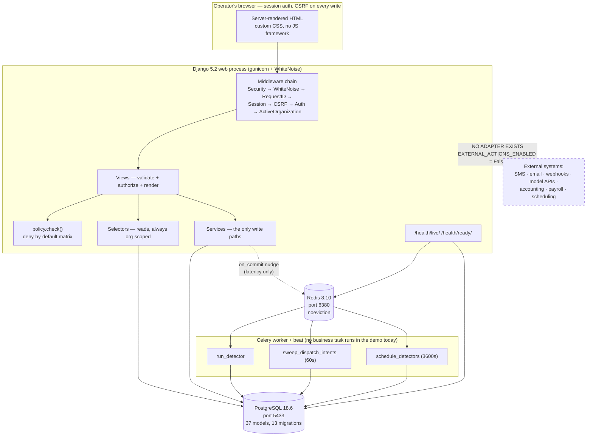
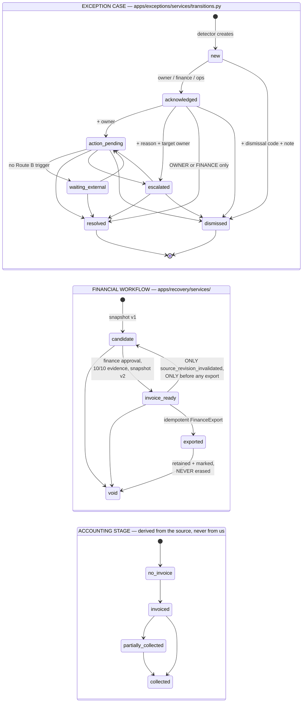

# HandoffSignal V2 — Phases 0–6 Engineering Handoff

> **Inspection basis.** This document was produced by reading the repository and running
> its own validation commands on **2026-08-29, 15:28–15:52 EDT (UTC−04:00)**. Every claim
> below is labelled with how it was established:
>
> | Tag | Meaning |
> |---|---|
> | **[VERIFIED]** | Confirmed by reading the implementation *and* by a test or command executed during this inspection |
> | **[DOC-ONLY]** | Asserted by a repository document; not independently confirmed here |
> | **[INFERRED]** | Deduced from code structure; not directly executed |
> | **[UNVERIFIED]** | Could not be established in this environment; the reason is stated |
> | **[DEFECT]** | A confirmed defect found by this inspection or carried from a prior review |
> | **[DEFERRED]** | Deliberately not built, with the authority for that decision cited |
>
> **Naming.** The repository, its documents, and its code use the working codename
> **`OpsRecovery V2`** throughout. The name *HandoffSignal* appears **nowhere** in the
> repository. This document uses the name from the assignment title for the product and
> `OpsRecovery V2` when naming what is actually in the code. See §18, Q1.
>
> **No product file was created, modified, or deleted by this inspection.** The only file
> written is this one. No commit was made.

---

### Initial repository verification

Recorded before any other work, and re-checked at the end. [All VERIFIED]

| Item | Value |
|---|---|
| **Absolute repository path** | `/Users/amanabbas/Desktop/Project AI/V2/ops-recovery-v2` |
| `git rev-parse --show-toplevel` | Resolves to exactly that path — no parent repository was adopted |
| **Current branch** | `v2-commercial-cleaning` |
| **Current commit** | **None.** `git rev-parse HEAD` → `fatal: ambiguous argument 'HEAD': unknown revision` |
| **Does the repository have commits?** | **No.** `git status` reports "No commits yet" |
| **Tracked files** | **0** |
| **Staged files** | **0** |
| **Modified (unstaged) files** | **0** |
| **Untracked files (excluding ignored)** | **229** |
| **Untracked entries including ignored** | 12,508 (mostly `.venv/`) |
| **Committed or local only?** | **Local only.** Nothing is version-controlled. Everything is untracked in one working tree with no remote configured |
| **Inspection date/time** | 2026-08-29, 15:28–15:52 EDT (UTC−04:00) |

**Working-tree status (complete, unedited):**

```
On branch v2-commercial-cleaning
No commits yet
Untracked files:
  .dockerignore
  .env.example            <- names only; opened for NAMES, never values
  .gitignore
  .python-version
  CLAUDE_V2_COMMERCIAL_CLEANING_MASTER_PROMPT.md
  Dockerfile
  Makefile
  README.md
  apps/         compose.yaml   config/    docs/     manage.py
  pyproject.toml  sample_data/  static/   templates/  tests/   uv.lock
nothing added to commit but untracked files present
```

**Toolchain and dependency versions**

| Component | Version | How established |
|---|---|---|
| Python (project) | **3.13.15** — uv-managed, in `.venv` | `.python-version`; `.venv` |
| Python (system) | 3.9.6 — **untouched**, as designed | `python3 --version` |
| uv | 0.12.6 (Homebrew) | `uv --version` |
| Django | 5.2.x (pinned `>=5.2.17,<5.3`) | `pyproject.toml`; `uv.lock` |
| psycopg | `[binary]>=3.3,<3.4` | `pyproject.toml` |
| Celery | `[redis]>=5.6.3,<5.7` | `pyproject.toml` |
| gunicorn / whitenoise | `>=26.2,<27` / `>=6.12,<7` | `pyproject.toml` |
| pytest / pytest-django | `>=9.1,<10` / `>=4.14,<5` | `pyproject.toml` |
| ruff / mypy (via django-stubs) | `>=0.16.4,<0.17` / `compatible-mypy` | `pyproject.toml` |
| Playwright | 1.62.0, Chromium **installed** (`chromium-1234`) | `uv run playwright --version` |
| Docker | 29.2.1, daemon running | `docker --version`, `docker info` |

**Database, cache, worker and web architecture (observed running)**

| Service | Image | State | Port |
|---|---|---|---|
| PostgreSQL | `postgres:18.6-trixie` (`opsrecovery-v2-db`) | Up 2 days (healthy) | 127.0.0.1:5433 |
| Redis | `redis:8.10-alpine` (`opsrecovery-v2-redis`) | Up 2 days (healthy) | 127.0.0.1:6380 |
| Web | Django 5.2 + gunicorn + WhiteNoise | Not running during inspection; started only for tests | 8000 |
| Worker / beat | Celery, same image, different command | **Not running.** No business task has ever run against a real worker (F-N7) | — |

**Was V1 or any repository outside `ops-recovery-v2` modified?**

**No.** [VERIFIED]

| Repository | State |
|---|---|
| `A.I. Product/shiftcare-prod` (the V1 reference) | `main` @ `a6cc7d5`, **0 dirty entries** — identical to the baseline recorded at every phase |
| `SHIFTCARE BACKUP FILE 1` | Last commit `2fb977e` (2026-07-02); 3 untracked files dated **17 July / 2 July** |
| `SHIFTCARE BACKUP FILE 1 copy` | Last commit `2fb977e` (2026-07-02); 4 untracked files dated **17 July / 2 July / 9 August** |

Every untracked file in the two backup repositories predates the V2 build (which began
2026-08-27), so none was created or touched by it. No denylisted file was opened at any
point: `.env.example` was read for variable **names** only, and no `.env`, `CREDENTIALS.*`,
key, or database file was accessed.

**The working tree was not cleaned or altered.** `git status --porcelain | wc -l` returned
**19** at the start of the inspection and **19** at the end (see §Completion).

---

## 1. Executive Summary

### What the product currently does

OpsRecovery V2 is a **read-only overlay** for commercial-cleaning contractors. It ingests
four CSV exports (contract scope, an identity crosswalk, work orders, and an accounting
invoice ledger), resolves the fact that the three source systems use **different
identifiers for the same customer and site**, and then runs one deterministic rule to find
work that was completed and authorised but has no matching invoice in the accounting
ledger. Each finding becomes an auditable case with an explanation, a severity, a deadline
and a *candidate* money figure. A finance reviewer works a ten-item evidence checklist,
approves the item as invoice-ready, and exports a 20-column CSV that a bookkeeper can use
to raise the invoice **in their own accounting system**. [VERIFIED — `make demo-reset`
executed this end to end; 20 Playwright tests drive the same path in a real browser.]

The four money stages — candidate, invoice-ready, confirmed invoiced, confirmed collected
— are computed independently, displayed separately, and never summed.
[VERIFIED — `apps/recovery/selectors.py:39-96`; `tests/test_recovery_ledger.py`.]

### What it does not do

It creates no invoice, posts nothing, sends nothing, and writes to no source system.
`EXTERNAL_ACTIONS_ENABLED` is hard-coded `False` in settings and additionally validated at
startup; no provider adapter of any kind exists to enable.
[VERIFIED — `config/settings/base.py:24`, `config/env.py:203-220`,
`tests/test_project_boundaries.py:27-32`.]

It has **no** attendance/no-show journey, **no** quality/inspection journey, no worker,
shift, time-entry or quality-event model, no messaging, no live integration, and no
deployed environment. [VERIFIED — the models are absent from
`apps/operations/models.py`; `tests/test_project_boundaries.py` asserts their absence.]

### Who it is intended for

A privately owned commercial-cleaning contractor with roughly 20–150 field cleaners and
two or more disconnected systems (operations platform, contract register, accounting),
initially in the DMV market. Five roles are modelled: organization owner, operations
manager, site supervisor, finance reviewer, and read-only auditor.
[DOC-ONLY — the ICP is a stated hypothesis in
`CLAUDE_V2_COMMERCIAL_CLEANING_MASTER_PROMPT.md:328-339`; **zero customer interviews have
been conducted**, per `docs/phases/PHASE_0A.md:23-33`.]

### The single implemented workflow

**Journey B — "completed but not invoiced."** One detector,
`REVENUE_COMPLETED_UNBILLED_V1`, evaluating eight conditions.
[VERIFIED — `apps/exceptions/detectors/revenue_unbilled.py`.]

### Current build state

| Fact | Value | Basis |
|---|---|---|
| Phases built | 0, 0A, 1, 2, 3, 4, 6 | [VERIFIED] |
| Phase 5 | **Deliberately skipped**, never started | [VERIFIED] |
| Phases 7, 8 | Not started; blocked by the Route B gate | [VERIFIED] |
| Git commits | **Zero.** Nothing is version-controlled. | [VERIFIED] |
| Tests | 839 pass (non-browser), 859 with browser, 0 fail | [VERIFIED] |
| Coverage | 88% (floor 85%) | [VERIFIED] |
| Lint / format / types | All clean | [VERIFIED] |
| Deployment | None. No Railway resource exists. | [VERIFIED] |

### Is Phase 6 truly implemented?

**Yes, substantively — with one significant carve-out.** [VERIFIED]

The Route B revenue subset is genuinely built and genuinely enforced: the ten-item
checklist has no bypass parameter (`apps/recovery/services/checklist.py`), the approval
service builds its own checklist rather than trusting a caller
(`apps/recovery/services/approvals.py:126-132`), the export re-proves "still unbilled"
under its own row lock before writing anything
(`apps/recovery/services/exports.py:221-246`), the export is idempotent and immutable,
every exported cell is formula-neutralised, and cross-tenant export download returns 404
rather than 403. All of this is exercised by 20 real-browser tests that passed during this
inspection.

**The carve-out:** the **cockpit at `/app/` — which is `LOGIN_REDIRECT_URL`, the first page
every user sees after signing in — was never updated for Phase 6.** It still calls the
Phase 4 money selector and still tells the viewer that three of the four financial stages
are "not available in this phase." It also leaks organization-wide money to a
site-scoped reader. Both are confirmed empirically in §7.6 and §10 (F-N1, F-N2). Phase 6
is implemented in the *recovery ledger*; it is not reflected on the *landing page*.

### Readiness

| Category | Status | Why |
|---|---|---|
| **Internal demonstration** | **Ready with conditions** | The golden path works end to end and resets in one command. Conditions: present from `/app/recovery-ledger/`, not from the cockpit landing page (F-N1, F-N2); expect the cockpit's freshness panel to read "stale" (F-N6). |
| **Prospect demo, synthetic data** | **Not ready** | Three blockers, none of them deep: the landing page contradicts the product's own capability (F-N2) and leaks money across site scope (F-N1); the source-freshness panel self-reports stale data because the fixture's `source_as_of_at` is frozen at 2026-08-20 (F-N6). Additionally there is **no demo runbook and no presenter script** in the repository, and Phase 7 (polish) was deliberately skipped. Estimated remediation is small — see §15 Phase B/C. |
| **Sanitized-data feasibility exercise** | **Not ready** | No data-mapping worksheet, no sanitisation guidance, no retention or deletion procedure, and no defined transfer path exist in the repository. The import form's own validation logic is the least-tested code in the application (`apps/ingestion/forms.py`, 47% coverage) and is precisely the surface a feasibility exercise stresses. |
| **Pilot with real customer data** | **Not ready** | No login rate limiting, no MFA, no deployed environment, no backups, no error monitoring, no incident-response procedure, no retention/deletion capability, no customer agreement, and a demo seed command carrying a shared hard-coded password that is permitted to run in a `demo` environment (F-N3). |
| **Production use** | **Not ready** | The product has zero customers, zero pilots, and zero validating interviews. It is a synthetic concept by explicit design (`docs/phases/PHASE_0A.md`). |

### The five most important risks

1. **Nothing is committed to version control.** [VERIFIED] Twelve working days of
   engineering across seven phases exist only as untracked files in one directory on one
   laptop. There is no history, no branch protection, no remote, and no recovery path from
   an accidental deletion. This is the single highest-severity issue in the repository and
   it is unrelated to code quality. See F-N0.
2. **The post-login landing page contradicts the product and leaks money across site
   scope.** [VERIFIED, F-N1/F-N2] A supervisor with zero site grants sees `$480.00` and a
   "Medium: 1" severity tile on `/app/` while the same page's headline reads "Open cases:
   0" — and the recovery ledger correctly shows them nothing. This is the same defect
   class that Phase 2 review finding 2 and Phase 6 review finding 4 each declared
   resolved; it survives on the one page a prospect sees first.
3. **The demo seed command creates six accounts sharing one hard-coded password, and its
   guard permits `APP_ENV=demo`.** [VERIFIED, F-N3] Any Railway "synthetic demo"
   deployment that runs `seed_demo` would be publicly reachable with a credential written
   in the source. This must be closed *before*, not after, the first hosted demo.
4. **No test has ever executed a real Celery worker.** [VERIFIED, F-N7]
   `make test-worker-integration` still prints "no worker_integration tests are registered
   yet (expected in Phase 1)" at the end of Phase 6. The durable-dispatch, lease-reclaim
   and crash-boundary guarantees are tested only in-process with
   `CELERY_TASK_ALWAYS_EAGER=True`. The reliability story is asserted, not demonstrated.
5. **Zero customer evidence underpins every threshold, field and CSV column.** [DOC-ONLY,
   and openly stated by the build itself in `docs/phases/PHASE_0A.md:23-33`] The 30-day
   deadline grace, the $1,000 severity threshold, the four-file contract shape, and the
   assumption that anyone can declare bounded complete coverage on an import (assumption
   A4) are all unvalidated. The correct next action is interviews, not more code.

---

## 2. Product Definition and Scope Boundaries

### The business problem

A cleaning contractor's *operational* record of what was done (an operations platform, a
work-order app, spreadsheets) and its *accounting* record of what was billed (QuickBooks
or similar) are separate systems that do not share identifiers. Work that was genuinely
completed, genuinely authorised, and genuinely billable can therefore fall between them
and never reach an invoice. Nobody owns the reconciliation, and it is invisible until
someone reads both exports side by side.
[DOC-ONLY — `CLAUDE_V2_COMMERCIAL_CLEANING_MASTER_PROMPT.md:262-281`.]

The wedge is explicitly **not** another scheduler, time clock, inspection app,
work-order suite, payroll system or invoice generator; the master prompt names five
incumbents that already ship all of that (§7).

### Intended customer profile

Privately owned commercial-cleaning contractor; multiple recurring office / retail /
light-industrial sites; ~20–150 field cleaners; two or more disconnected tools; a real
cross-identifier reconciliation problem; able to export contract, work-order and
accounting data; willing to start in read-only shadow mode.
Anti-profile: solo operators, enterprises already fully on WinTeam/Aspire, and any
federal / airport / school / healthcare / correctional contract.
[DOC-ONLY — master prompt §9.1–9.2.]

### Intended users and roles

Five tenant roles, implemented as `Role` in [`apps/organizations/roles.py:23-35`]:
`owner`, `operations_manager`, `supervisor`, `finance_reviewer`, `auditor`. Django's
`is_staff` is platform administration and is explicitly separate from the tenant `owner`
role. [VERIFIED — `apps/organizations/models.py:80-83`.] Full matrix in §6.

### Journey B / Route B

**Route B** is the delivery strategy: a capped synthetic concept, 8–12 working days, one
thin vertical slice, chosen because a demo was wanted to obtain interviews. It explicitly
does **not** validate the market. **Journey B** is the slice that was chosen: "completed
but not invoiced." [VERIFIED — chosen and reasoned in `docs/phases/PHASE_0A.md:9-45`;
authorised by master prompt §Phase 0A "Optional route B".]

`docs/phases/PHASE_0A.md:120-127` records an ordering defect in Route B that is worth
carrying into any planning conversation: Route B forbids Railway deployment *and* skips
the polish phase, so its deliverable is an unpolished localhost application that cannot be
emailed or linked — **the artifact built to get interviews requires an interview to show
it.** This inspection confirms that is still true today.

### "Completed but not invoiced" logic

Summarised here; specified fully in §7. A work order is flagged only when it is billable
with a confirmed canonical mapping, `completed` with a completion instant, supported by a
service obligation whose configured uninvoiced delay has elapsed, authorised where either
the work order **or** the contract policy requires it, under a contract active on the
service date, on a supported billing basis, with non-stale operations and accounting
feeds — and only then, last, when a coverage declaration proves the accounting snapshot
completely covers that customer/site for that date and contains no matching posted
invoice. [VERIFIED — `apps/exceptions/detectors/revenue_unbilled.py:323-460`.]

### Operational evidence versus accounting evidence

This distinction is the product. Operational evidence (a work order says it was completed
and authorised) can never establish that something was *not billed*; only the accounting
source can, and only when it has declared that it completely covers the relevant scope and
interval. The detector enforces the ordering structurally: every positive, cheap check
runs first, and the negative-evidence claim runs **last and only after coverage is
proven** — `_accounting_coverage_proves_absence()` is called before
`_confirmed_invoice_exists()`, and failing the former yields `insufficient_coverage`
rather than a case. [VERIFIED — `revenue_unbilled.py:390-396`;
`tests/test_detector_revenue.py`.]

The demo fixture makes this non-trivial on purpose: **the accounting export carries no
work-order identifier on any row**, so reconciliation must run on the confirmed
customer/site crosswalk plus service date.
[VERIFIED — `sample_data/atlas_facility_services/invoice_status.csv` header has
`work_order_external_id` present but empty on every row.]

### The four stages

| Stage | Meaning | Where it comes from | Implementation |
|---|---|---|---|
| **Candidate value** | Contract-supported amount that *may* be billable | Derived by `CANDIDATE_VALUE_V1` from the work order and obligation | `revenue_unbilled.py:220-276`; snapshot v1 |
| **Invoice-ready value** | A human-reviewed amount approved for handoff | Finance approval over a complete checklist | `approvals.py:154-168`; immutable snapshot v2 |
| **Confirmed invoiced** | What the accounting source says was invoiced | Accounting source only | `accounting.py:97-189` |
| **Confirmed collected** | What the accounting source says was collected | Accounting source only | `accounting.py:156-189` |

Unknown is **NULL, never zero**, at every layer — including two database check
constraints preventing a `manual_amount_required` snapshot from carrying either a
candidate or an approved value. [VERIFIED — `apps/exceptions/models.py`
`ck_snapshot_manual_basis_has_no_value` and
`ck_snapshot_manual_basis_has_no_ready_value`.]

Aggregation refuses rather than guesses: a mixed-currency set withholds **every** total
rather than adding USD to EUR, and a disputed item is excluded from the two confirmed
columns while remaining visible in the two claimed ones.
[VERIFIED — `apps/recovery/selectors.py:59-95`; `tests/test_recovery_ledger.py::TestCurrency`.]

### Explicit non-goals and features intentionally not built

| Not built | Authority | Confirmed absent by |
|---|---|---|
| `Worker`, `Shift`, `TimeEntry`, `WorkerAvailabilityWindow` | Route B matrix, master prompt line 2296 | `apps/operations/models.py` docstring; `tests/test_project_boundaries.py` |
| `QualificationType`, `SiteRequirement`, `WorkerQualification`, `WorkerSiteAuthorization` | same | same |
| `QualityEvent`, corrective actions, client-notification state | same | same |
| `SiteOperationalRule` | Every field is an attendance/quality input | `docs/DATA_DICTIONARY.md:23-25` |
| `workers_eligibility`, `scheduled_shifts`, `time_entries` importers | Route B Phase 3 subset | `get_contract` raises `ContractNotImplemented` |
| `RecommendationSet`, `CandidateAssessment`, `ProposedAction`, draft handoff | Phase 5 skipped | `apps/recovery/models.py:6-9` |
| `EvidenceArtifact`, arbitrary evidence upload | `EVIDENCE_MODE=metadata_only` | `config/env.py:216-220` |
| Any messaging / model-API / source-system adapter | Master prompt §3.4 | No adapter exists in the tree |
| Django admin | Not enabled | No `admin/` route in `config/urls.py` |

An unimplemented importer **raises** rather than returning an empty result, so a missing
feature cannot masquerade as a successful no-op. [VERIFIED — `apps/ingestion/contracts/registry.py`.]

### Journey A and Journey C status

**Both unbuilt, with no placeholder behaviour.** This is deliberate: the master prompt
states a read-only stub would itself be a violation. The `ExceptionType` enum carries all
three values for specification fidelity, but `ROUTE_B_EXCEPTION_TYPES` is a frozenset of
exactly one, `DETECTORS` in `apps/exceptions/services/runs.py:36` maps exactly one code,
and `transitions._roles_for()` returns an **empty** role set for any non-revenue case
rather than guessing. [VERIFIED — `apps/exceptions/models.py`;
`apps/exceptions/services/transitions.py:98-100`.]

### Phase 5 status and why it was skipped

**Skipped entirely. Never started. Must not be recorded as complete.** [VERIFIED]

Phase 5 is "Replacement recommendation and human-approved handoff" — the Journey A
deliverable. The Route B executable phase matrix in the master prompt says simply
"5 | Skip." Journey A was rejected on cost: 15–20 days against Route B's 8–12 day cap,
because it needs every omitted worker/shift/time model *plus* all of Phase 5, to
demonstrate a hypothesis (schedule and time usually live in one system) that is weaker
than Journey B's. [VERIFIED — `docs/phases/PHASE_0A.md:47-56`.]

The consequence is visible in the code: `Approval` models only one subject
(`financial_recovery_item`), because `recommendation_set` and `proposed_action` point at
models that do not exist. The check constraint asserts the one reachable subject is
present; evidence-expansion step E3 would widen it.
[VERIFIED — `apps/recovery/models.py:28-37`.]

### External actions and source-system write-back

**None, structurally.** `EXTERNAL_ACTIONS_ENABLED` is not merely `False` by default — it
is assigned the literal `False` in `config/settings/base.py:24` and is not configurable
upward, and `config/env.py:203-215` raises `ConfigurationError` at startup if the
environment variable is true. There is no adapter, no outbox, no webhook envelope and no
provider dependency; `tests/test_project_boundaries.py:86` asserts no messaging provider
package is declared. [VERIFIED]

### Does the product create, post, send, or modify invoices?

**No.** It produces a CSV describing work a bookkeeper may choose to invoice, in their own
system. The approval success message reads "Approved as invoice-ready. No invoice was
created." and the export message ends "No invoice was created and nothing was sent."
[VERIFIED — `apps/recovery/views.py:114`, `:139-143`; asserted by
`tests/browser/test_journey_b.py:105`.]

---

## 3. Phase-by-Phase Implementation Record

> Approvals are recorded in `docs/BUILD_STATUS.md`. Every phase is marked
> `complete_pending_review` — that is, Claude reported completion and the owner approved
> proceeding, but no phase has been formally reviewed and signed off. No phase is
> `approved` in the sense the master prompt reserves for owner sign-off.

### 3.1 Phase 0 — Read-only preflight

- **Objective.** Confirm the workspace, toolchain and V1 boundary before writing code.
- **Approved scope.** Inspection only; no code.
- **Deliverables.** A preflight report; `docs/phases/PHASE_0.md`.
- **Files created.** `docs/phases/PHASE_0.md` only.
- **Important decisions.** Adopt an isolated uv-managed Python 3.13 toolchain rather than
  the system Python 3.9.6 or V1's virtual environment.
- **Tests / verification.** None applicable.
- **Defects.** None recorded.
- **Deferred.** None.
- **Status: Complete.** [VERIFIED] Evidence: the system `python3` is still 3.9.6 while
  `.python-version` pins 3.13.15 and `.venv` runs 3.13.15 — the toolchain decision held
  and the system Python was not modified.

### 3.2 Phase 0A — Evidence gate and route selection

- **Objective.** Decide between evidence-first (Route A) and capped synthetic concept
  (Route B) before encoding assumptions.
- **Approved scope.** Analysis only. Owner wording: *"Proceed with Phase0A as we need a
  demo to get an interview."*
- **Deliverables.** `docs/phases/PHASE_0A.md` — route decision, journey selection
  rationale, the provisional source/crosswalk matrix, six ranked risk assumptions, and
  the mandatory post-Phase-6 evidence stop.
- **Important decisions.** (a) Route B; (b) Journey B over A and C, on cost and wedge
  strength; (c) three structurally different identifier dialects, so the demo cannot
  degrade into a join on a shared column; (d) one crosswalk row omitted on purpose so a
  dependent invoice row quarantines.
- **Tests / verification.** None applicable. The design decisions were later verified by
  the fixtures: the crosswalk gap does fire, and does block readiness.
- **Defects discovered.** Two findings the document itself refuses to bury: assumption A1
  ("a working demo is what unblocks interviews") is **unmeasured**; and Route B contains
  an **ordering defect** — it produces an artifact that requires an interview to show.
  Both remain open and unaddressed today. [VERIFIED — no outreach log, no runbook, and no
  hosted environment exists in the repository.]
- **Deferred.** Everything outside Journey B.
- **Status: Complete.** [VERIFIED] This is the strongest document in the repository and
  should be read first by anyone new.

### 3.3 Phase 1 — Isolated foundation

- **Objective.** A reproducible Django / PostgreSQL / Redis / Celery skeleton that cannot
  reach V1 or any live service.
- **Approved scope.** Foundation only, no business logic. Owner wording: *"Apporve
  synthetic-concept Phase 1"* (read as `Approve synthetic-concept Phase 1`).
- **Implemented deliverables.** Split settings (`base`/`local`/`test`/`production`);
  custom `User` model in the initial migration; Docker Compose PostgreSQL 18.6 + Redis
  8.10 on non-default ports 5433/6380; Celery wired with **no** business task; WhiteNoise
  + Gunicorn; `/health/live/` and `/health/ready/`; `.env.example` with names only;
  network-blocking test guard; test-database guard.
- **Files created.** `config/` (settings, `env.py`, `dbguard.py`, `celery.py`,
  `logging_utils.py`, `urls.py`, `wsgi.py`, `asgi.py`); `apps/common/`;
  `apps/organizations/models.py` + `auth_backends.py`; `Dockerfile`; `compose.yaml`;
  `Makefile`; `pyproject.toml`; `uv.lock`; ADRs 0001–0006.
- **Important decisions.** ADR 0001 (standalone workspace, not an in-place V1 rewrite);
  ADR 0002 (Django 5.2 LTS, server-rendered, no DRF/React); ADR 0003 (PostgreSQL 18 only,
  SQLite rejected at parse time in every environment); ADR 0004 (Celery+Redis, external
  actions deferred to Phase 11); ADR 0005 (Railway, separate project — **planning only**);
  ADR 0006 (stdlib URL parsing, `django-stubs[compatible-mypy]`, built-in Celery beat).
- **Tests / verification.** 165 tests passing at the time. Health-endpoint behaviour was
  manually verified with dependencies stopped.
- **Defects discovered and fixed (5).** Notably: the network blocker's own tests were
  **passing vacuously** because pytest imported `conftest.py` under a synthetic module
  name, creating a second exception class — fixed by moving the guard to
  `tests/network_guard.py`; and the V1-import detector matched substrings and flagged
  `from config.celery import app as celery_app` — replaced with a top-level-import regex
  plus a self-test proving the detector is not vacuous.
- **Remaining findings.** No rate limiting; no MFA; Django admin not enabled; Django 5.2
  is security-only support.
- **Deferred.** Tenancy (Phase 2).
- **Status: Complete, unreviewed.** [VERIFIED] Evidence: all Phase 1 artefacts exist and
  the foundation tests still pass today.

### 3.4 Phase 2 — Tenant identity, RBAC, operational primitives

- **Objective.** Multi-tenancy, role-based access control, and the Journey B domain.
- **Approved scope.** Route B subset — omit worker/shift/time/quality models.
- **Implemented deliverables.** `Organization`, `Membership`, `MembershipRoleGrant`,
  deny-by-default `MembershipSiteGrant`; `CustomerAccount`, `Site`, `Contract`,
  `ContractSite`, `ServiceObligation`, `WorkOrder`, `AccountingInvoice`,
  `AccountingPayment`; `DataSource`, `ExternalEntityReference`,
  `IdentityResolutionIssue`, `SourcePrecedenceRule` + `SourcePrecedenceEntry`,
  `ReconciliationIssue`; tenant middleware; scoped selectors; the §9.3 role policy;
  login/logout/organization-selection; `create_owner` and `seed_demo` commands;
  `docs/DATA_DICTIONARY.md`.
- **Files created.** `apps/organizations/{models,policy,roles,selectors,context,views}.py`;
  `apps/operations/models.py`; `apps/ingestion/models.py`; management commands.
- **Important decisions.** Permission is a single function, `policy.check()`, that starts
  from denial; `effective_site_scope()` is deliberately three-valued (`None` = tenant-wide,
  non-empty set = those sites, **empty set = no sites**), so an empty grant set can never
  widen to tenant-wide.
- **Tests / verification.** 488 passing; cross-tenant POST of a real foreign UUID returns
  404 indistinguishable from an unknown UUID.
- **Defects discovered and fixed (3, all BLOCKING, all in shipped code).**
  (1) `SourcePrecedenceEntry` was a plain `models.Model` with no organization column — a
  cross-tenant edge through a join table; now tenant-scoped, plus a **generic guard test**
  that fails for *any* tenant-owned model lacking a non-null organization, so the class of
  bug cannot recur silently. (2) The dashboard scoped only by organization, so a
  supervisor with zero site grants saw every site. (3) The test for (2) was **vacuous** —
  it asserted an explanatory sentence appeared, and passed while the page listed every
  site; rewritten to assert rendered identifiers and **proven to fail when the fix is
  reverted**.
- **Remaining findings (3, open).** See §10: F-P2-4 (`_guards.py` permits `APP_ENV=test`
  and lacks a `DEMO_MODE` gate), F-P2-5 (role-matrix tests should parametrise from the
  shipped `Action` enum), F-P2-7 (stale-session-hint auto-select is undocumented).
- **Deferred.** No database exclusion constraint for overlapping effective periods
  (needs `btree_gist`); same-tenant foreign keys enforced in `clean()` and tests rather
  than by a database constraint (Django 5.2 cannot express a cross-row tenant predicate).
- **Status: Complete, unreviewed, with 3 open findings.** [VERIFIED — the three findings
  are still present in the code today; `_guards.py:12` still reads
  `("local", "test", "demo")`.]

### 3.5 Phase 3 — CSV import, preview, commit, source history

- **Objective.** A safe, idempotent, human-committed import path with declared coverage.
- **Approved scope.** Four contracts only: `sites_contracts`, `entity_crosswalk`,
  `work_orders_service_events`, `invoice_status`.
- **Implemented deliverables.** `ImportBatch`, `ImportCoverage`, `ImportRow`,
  `SourceRecordVersion`, `ReconciliationRun` + `ReconciliationRunInput`; four validators;
  upload/preview/commit/history/results screens; identity-crosswalk import and an
  unresolved-reference resolution queue; a reconciliation/conflict queue; idempotent
  upsert; all 29 row-level error codes; source-freshness fields and UI; valid, boundary,
  duplicate and invalid fixtures; `generate_sample_data`.
- **Files created.** `apps/ingestion/{parsing,forms,errors,views,selectors}.py`,
  `contracts/`, `services/{imports,normalizers,identity,reconciliation,coverage}.py`;
  `sample_data/atlas_facility_services/`.
- **Important decisions.** Preview writes nothing; commit is all-or-nothing in one
  transaction; exact replay does no semantic work; completeness is **declared on the
  form**, never inferred from filename, row count or freshness; a fact arriving before its
  canonical entity is **quarantined**, never guessed.
- **Tests / verification.** 612 passing. Verified live: replaying an identical file
  redirects to the same batch and leaves one batch in the database; the Potomac invoice
  whose crosswalk was deliberately omitted is rejected, opens an identity issue, and
  **blocks** reconciliation readiness.
- **Defects discovered and fixed (3).** The work-order validator rejected any row whose
  authorization was required but absent — **deleting the very negative control the demo
  needs**; duplicate detection fingerprinted the whole row, so two legitimate payment rows
  for one invoice looked like conflicting duplicates; and the quarantine fixture never
  actually fired because no invoice referenced the unmapped site.
- **Remaining findings.** Coverage scope is declared at organization level in the form
  (customer/site/work-order scopes exist in the model but have no form control); no
  automatic conflict *scanner*; no CSV download of rejected rows; uploads parsed from
  memory under the 5 MB limit rather than streamed.
- **Deferred.** The other three CSV kinds; retention rules (Phase 10).
- **Status: Complete, unreviewed.** [VERIFIED — `make demo-reset` re-executed the whole
  four-file import today: `+3 / +17 / +4 / +4` with one row unchanged and one identity
  quarantined and resolved.]

### 3.6 Phase 4 — Exception engine, state machine, audit, inbox

- **Objective.** Deterministic detection, a guarded case lifecycle, durable dispatch, and
  an inbox.
- **Approved scope.** **One** detector, not three.
- **Implemented deliverables.** `DetectorDispatchIntent`, `DetectorRun`,
  `DetectorScheduleLease` with database leases; `ExceptionCase`, `ExceptionSourceLink`,
  `ExceptionEvent`, `FinancialImpactSnapshot`, `FinancialRecoveryItem`, `AuditEvent`;
  `REVENUE_COMPLETED_UNBILLED_V1`; stable fingerprints and occurrence-based dedup; the
  transition command service as the only path to `state`; deadline/severity;
  freshness suppression read from the immutable manifest; identity/reconciliation
  blocking; cockpit, inbox, case detail, timeline; `run_detectors` command; Celery task;
  periodic schedule with a lease.
- **Important decisions.** ADR 0007 records the five local rules the specification leaves
  open — see §7.
- **Tests / verification.** 746 passing.
- **Defects discovered and fixed (8).** Three were **false-positive paths**: service date
  derived from the completion instant, so an overnight job finished at 01:30 dated to D+1
  and would have flagged already-billed work; a coverage row proved absence while its
  batch still held a quarantined row; and authorization checked only the work-order flag,
  ignoring the contract's own policy. Also: a case could be **duplicated** by a rule
  version bump; open cases whose work order stopped matching were never touched;
  a `FAILED` DetectorRun could never be retried; freshness was read from the mutable
  `DataSource` row; and `publish_intent` wrapped claim and publish in one transaction, so
  a broker failure erased the lease and attempt count the sweeper needs.
- **Remaining findings (3, open).** F-P4-9 (ambiguous invoice across two same-day work
  orders), F-P4-10 (`case_number` uses count-plus-retry, not a sequence), F-P4-11
  (deadline grace and severity threshold are placeholders).
- **Deferred.** `waiting_external` has no trigger in this phase; attendance and quality
  detectors deliberately absent.
- **Status: Complete, unreviewed, with 3 open findings.** [VERIFIED]

### 3.7 Phase 5 — Replacement recommendation and human-approved handoff

**SKIPPED. Not implemented. Not started. Not complete.** [VERIFIED]

- **Original objective (unexecuted).** Replacement candidate generation with hard
  exclusions and transparent ranking; a human-approved, immutable bilingual draft handoff
  packet marked `prepared`, never `sent`; recording an externally confirmed outcome.
- **Authority for skipping.** Master prompt Route B executable phase matrix: "5 | Skip."
  Recorded in `docs/BUILD_STATUS.md` and `docs/phases/README.md`.
- **Evidence it was not partially built.** No `RecommendationSet`, `CandidateAssessment`,
  `ProposedAction`, `DraftHandoffPacket` or eligibility service exists anywhere in
  `apps/`. `apps/recovery/models.py:6-9` states the omission explicitly, and the
  `Approval` model carries only the one reachable subject foreign key because the other
  two would point at non-existent models. `tests/test_project_boundaries.py` allows
  exactly `Approval` and `FinanceExport` among Phase 5/6 tables and forbids the rest.
- **Deferred work.** All of it, to evidence-expansion step E3, and only if Journey A is
  approved by interview evidence.

### 3.8 Phase 6 — Route B revenue slice

- **Objective.** Evidence checklist, approval, immutable invoice-ready snapshot, export,
  accounting reconciliation, and the recovery ledger.
- **Approved scope.** Revenue subset **only**. Owner wording: `Approve Route B Revenue
  Slice`. Journey C, arbitrary evidence handling, and client-notification behaviour
  excluded.
- **Implemented deliverables.** The ten-item checklist; the approval service with no
  bypass; an immutable invoice-ready snapshot (v2 of the candidate); a 20-column
  idempotent, immutable, formula-safe CSV export; a tenant- and role-scoped download; the
  five accounting-stage rules of §23.1 and eight dispute reasons; the recovery ledger
  showing four separate facts; seven Playwright control groups; `make demo` /
  `make demo-reset`.
- **Files created.** `apps/recovery/` (models, views, selectors,
  `services/{checklist,approvals,exports,accounting}.py`,
  `management/commands/demo_load.py`); `templates/recovery/ledger.html`;
  `tests/browser/test_journey_b.py`; ADR 0008; migrations `recovery/0001_initial` and
  `exceptions/0004`.
- **Important decisions.** ADR 0008 — `FinanceExport` as a first-class immutable record
  (the specification assumes an export in four places but defines no model); the
  idempotency key is the item set at its *approved snapshots*, deliberately **not**
  including `item.version` because the export transaction bumps it; the export re-proves
  "still unbilled" under its own lock; one export carries one currency; an accounting
  commit is what advances the accounting stage.
- **Tests / verification.** 839 non-browser plus 20 browser tests. **All 859 re-executed
  and passing during this inspection.**
- **Defects discovered and fixed (11 against shipped code; 6 could have shown a wrong
  number or caused a second invoice).** The three worst: the export **never re-checked
  that the work was still unbilled**, so an `invoice_status` import landing between
  approval and export produced a file telling a bookkeeper to invoice work that had just
  been invoiced — the exact kill criterion the product exists to avoid;
  `accounting.refresh` **had no caller anywhere in `apps/`**, so the ledger's confirmed
  columns could never have filled; and `stage_totals` ignored site scope. Also:
  cross-currency summation; a disputed invoice counted as billed; snapshot immutability
  covering only three of ten value fields; a `manual_amount_required` snapshot able to
  carry an approved value; a crash in the ledger on an incomplete work order (via a bare
  `assert`, which is stripped under `-O`); a non-deterministic exported identifier; the
  inbox overflowing 375px by 229px; and vacuous absence assertions in the browser tests.
- **Remaining findings (4, open).** F-P6-12 (ambiguous invoice, carried), F-P6-13 (export
  provenance columns read live), F-P6-14 (fixture `source_as_of_at` fixed at 2026-08-20),
  F-P6-15 (three Phase 2 findings carried).
- **Findings this inspection adds.** The Phase 6 `stage_totals` site-scope fix was applied
  to `apps/recovery/selectors.py` only. **The cockpit still calls the unscoped Phase 4
  selector** and still labels three stages "not available in this phase" — see F-N1 and
  F-N2 in §10, both confirmed empirically.
- **Status: Complete for the recovery ledger, unreviewed; incomplete on the cockpit.**

---

## 4. System Architecture

### 4.1 Overview in prose

A single Django 5.2 application, server-rendered with Jinja-style Django templates,
custom CSS and no JavaScript framework. It is organised as seven apps under `apps/` with a
strict layering convention: **views** validate input and authorization, call a **service**,
and render; **selectors** are the only read paths and every one takes an explicit
organization; **services** are the only write paths for anything consequential.
[VERIFIED — ADR 0002; the convention holds throughout the code read for this report.]

Persistence is **PostgreSQL 18.6 only**. SQLite is rejected at configuration parse time in
every environment with an explicit error, not a silent fallback
(`config/env.py:110-114`). Redis 8.10 is the Celery broker, configured with
`maxmemory-policy noeviction` because evicted Kombu binding keys cause Celery
`InconsistencyError`. Both run in Docker Compose on deliberately non-default ports
(5433 and 6380) so they cannot collide with any other local instance, including V1's.
[VERIFIED — `compose.yaml`; both containers observed running during this inspection.]

Background work is Celery with at-least-once semantics stated explicitly
(`task_acks_late`, `task_reject_on_worker_lost`, `prefetch_multiplier=1`,
`visibility_timeout=3600`). Detector execution is **durable**: when a reconciliation run
becomes ready, a `DetectorDispatchIntent` row is inserted **in the same transaction**, so
readiness and the promise to evaluate commit or roll back together. An `on_commit` nudge
attempts immediate publication for latency; a periodic sweeper is the correctness path.
Duplicate broker deliveries are harmless because `DetectorRun` is unique on the immutable
evaluation identity `(organization, reconciliation_run, detector_code, rule_version,
input_manifest_sha256)`. [VERIFIED — `apps/exceptions/services/dispatch.py`;
`apps/exceptions/models.py`. **But see F-N7: no test has ever run a real worker.**]

Authentication is Django's session auth with a custom `EmailBackend` that normalises the
email before lookup — necessary because the model lowercases on save but `ModelBackend`
looks up `USERNAME_FIELD` exactly, so login was not genuinely case-insensitive without it.
There is no public signup; the first account of any organization is created by an operator
with shell access via `create_owner`, which sets **no** password (the operator runs
`changepassword`), so no known default is ever created by that path.
[VERIFIED — `apps/organizations/auth_backends.py`, `management/commands/create_owner.py:49-53`.]

Tenant selection is middleware-driven. The session holds only a **candidate** organization
id, re-validated against an active membership on **every** request — so revoking a
membership takes effect on the next request, not at the next login. The middleware
deliberately does **not** use a thread-local or process-global, because ambient tenant
state is unsafe under Celery workers; every background path receives its organization as
an explicit argument. [VERIFIED — `apps/organizations/context.py:81-103`.]

Authorization is one function, `policy.check()`, reading a declarative matrix. It starts
from denial: there is no branch that returns "allowed" for an unknown action, an unknown
role, or a missing grant. `require()` raises for services; `allows()` returns a boolean for
template rendering — so a hidden button and a rejected POST consult the same table and
cannot disagree. [VERIFIED — `apps/organizations/policy.py`.]

Site scope is separate from role. `effective_site_scope()` returns `None` for tenant-wide
roles and the **exact granted set** for a supervisor — including the empty set, which must
be passed through verbatim and never downgraded to "unfiltered".
[VERIFIED — `apps/organizations/policy.py:140-162`. **This contract is honoured by the
ledger and violated by the cockpit — see F-N1.**]

Static assets are served by WhiteNoise, positioned immediately after
`SecurityMiddleware` as required, and collected at Docker **build** time because Railway's
pre-deploy command runs in a separate container whose filesystem changes would not reach
the runtime. [VERIFIED — `Dockerfile:28-31`.]

**Planned Railway architecture** (ADR 0005, planning only, nothing provisioned): one new
Railway project separate from V1, a dedicated `demo` environment with the default
`production` environment left empty, five services (`v2-web`, `v2-worker`, `v2-beat`,
`v2-postgres`, `v2-redis`), a public domain on `v2-web` only, migrations run only by
`v2-web`, autodeploy disabled for the first hosted demo, region US East. See §12.

### 4.2 Component diagram



**Reading it without rendering:** the browser talks only to the Django web process. That
process runs a fixed middleware chain that assigns a request ID, establishes the session
and user, and resolves the active organization from a re-validated membership. Views
consult the policy matrix, read through org-scoped selectors, and write only through
services. Services and selectors reach PostgreSQL; services additionally place a
best-effort nudge on Redis after commit. Celery workers read from Redis and write to
PostgreSQL. Health endpoints touch both stores. **No arrow leaves the box to any external
system** — that boundary is enforced by a hard-coded settings value, a startup validator,
the absence of any adapter, and a test.

### 4.3 Request and data-flow diagram (CSV to invoice-ready export)

```mermaid
flowchart TD
    A["Owner / Ops uploads CSV<br/>+ declares observation mode,<br/>coverage interval, completeness"] --> B{"parse_csv<br/>UTF-8 strict, ≤5 MB,<br/>≤10k rows, header normalised"}
    B -->|"file error"| B1["Rejected — no batch created"]
    B -->|"ok"| C["ImportBatch (validating)<br/>+ immutable ImportRow per line<br/>+ ImportCoverage declarations"]
    C --> D["PREVIEW — writes nothing<br/>row-level errors shown"]
    D --> E{"Human clicks Commit<br/>role checked by FILE TYPE"}
    E --> F["commit() — one transaction<br/>normalise + upsert"]
    F --> G{"Every reference resolves via a<br/>CONFIRMED ExternalEntityReference?"}
    G -->|"no"| H["QUARANTINE the row<br/>open IdentityResolutionIssue<br/>never guess a canonical id"]
    G -->|"yes"| I["Upsert canonical record<br/>+ append SourceRecordVersion"]
    H --> J["Identity queue — OWNER ONLY"]
    J -->|"owner resolves"| K["reprocess_quarantined()<br/>batch becomes a complete<br/>observation of its own file"]
    K --> I
    I --> L{"ReconciliationRun readiness:<br/>all domains committed?<br/>no unresolved identity?<br/>no blocking issue?<br/>coverage present?"}
    L -->|"blocked"| L1["waiting_inputs<br/>named blockers shown"]
    L -->|"ready"| M["ATOMIC: status=ready<br/>+ DetectorDispatchIntent inserted<br/>in the SAME transaction"]
    M --> N["Detector evaluates 8 conditions<br/>positive facts first,<br/>negative claim LAST"]
    N --> O["ExceptionCase + candidate<br/>FinancialImpactSnapshot v1<br/>+ FinancialRecoveryItem"]
    O --> P["Finance reviewer opens<br/>/app/recovery-ledger/"]
    P --> Q{"10-item checklist<br/>rebuilt from CURRENT data<br/>no bypass parameter exists"}
    Q -->|"any item missing"| Q1["Approval BLOCKED<br/>exact missing items named"]
    Q -->|"all 10 pass"| R["Approval + immutable<br/>invoice-ready snapshot v2"]
    R --> S{"Export: re-prove items 8 and 9<br/>under its own row lock"}
    S -->|"now invoiced / disputed /<br/>already exported"| S1["REFUSED — zero writes"]
    S -->|"still unbilled"| T["FinanceExport — immutable,<br/>idempotent, formula-neutralised"]
    T --> U["Protected download<br/>403 wrong role · 404 wrong tenant"]
    U --> V["Bookkeeper raises the invoice<br/>IN THEIR OWN SYSTEM"]

    style B1 fill:#fdd,stroke:#900
    style L1 fill:#fdd,stroke:#900
    style Q1 fill:#fdd,stroke:#900
    style S1 fill:#fdd,stroke:#900
    style H fill:#ffd,stroke:#960
```



**Reading it without rendering:** the path is upload → parse → preview (which writes
nothing) → an explicit human commit → normalise. Any reference that does not resolve
through a *confirmed* crosswalk quarantines the row rather than guessing; only the owner
can resolve it, and resolving reprocesses the rows it was blocking. A reconciliation run
becomes ready only when every required domain is committed, no identity is unresolved, no
blocking issue is open, and coverage is declared — and readiness inserts the dispatch
intent in the same transaction. The detector then evaluates eight conditions with the
negative-evidence claim last. Finance works a checklist rebuilt from current data, and the
export re-proves the two accounting-dependent items under its own lock before writing
anything. Four distinct refusal points are marked in red; the quarantine path in amber is
a hold, not a rejection.

### 4.4 Route B case lifecycle



**Reading it without rendering:** three lifecycles run in parallel and never merge.
`ExceptionCase.state` is the operational lifecycle and changes **only** through the
transition service — the model's `save()` raises `DirectStateChangeError` on any state
change that did not pass through it, which makes "no view, admin, detector or task sets
state directly" testable rather than aspirational
[VERIFIED — `apps/exceptions/models.py:420-436`]. The financial workflow is the human
claim: candidate → invoice-ready → exported, with the reverse edge permitted only for
`source_revision_invalidated` and only before any export. The accounting stage is
**derived from the accounting source alone** and can advance even if the product never
exported anything — an invoice arriving through another process updates the stage, links
contradicting evidence, and flags the case for finance review, but **does not change
`ExceptionCase.state`**; a human must resolve or dismiss through the transition service.
[VERIFIED — `apps/recovery/services/accounting.py:11-15, 192-255`.]

`waiting_external` is encoded for specification fidelity but **has no trigger in Route B**,
because the thing that would move a case there is the Phase 5 approved handoff.
[VERIFIED — `apps/exceptions/services/transitions.py:68-78`.]

---

## 5. Data Model and Data Flow

**37 models across six apps**, 13 application migrations, applied cleanly to a fresh
PostgreSQL 18.6 database. [VERIFIED — `manage.py showmigrations`; model count enumerated
from the app registry during this inspection.]

| App | Models | Purpose |
|---|---|---|
| `organizations` | 5 | `User`, `Organization`, `Membership`, `MembershipRoleGrant`, `MembershipSiteGrant` |
| `operations` | 8 | `CustomerAccount`, `Site`, `Contract`, `ContractSite`, `ServiceObligation`, `WorkOrder`, `AccountingInvoice`, `AccountingPayment` |
| `ingestion` | 12 | `DataSource`, `ExternalEntityReference`, `IdentityResolutionIssue`, `SourcePrecedenceRule`, `SourcePrecedenceEntry`, `ReconciliationIssue`, `ImportBatch`, `ImportCoverage`, `ImportRow`, `SourceRecordVersion`, `ReconciliationRun`, `ReconciliationRunInput` |
| `exceptions` | 8 | `DetectorDispatchIntent`, `DetectorRun`, `DetectorScheduleLease`, `ExceptionCase`, `ExceptionSourceLink`, `ExceptionEvent`, `FinancialImpactSnapshot`, `FinancialRecoveryItem` |
| `recovery` | 3 | `Approval`, `FinanceExport`, `FinancialStageEvent` |
| `audit` | 1 | `AuditEvent` |

`docs/DATA_DICTIONARY.md` documents every one, and `tests/test_data_dictionary.py` fails
if a model exists without an entry — so the dictionary cannot silently drift from the
migrations. [VERIFIED]

### 5.1 Tenant ownership

Every tenant-owned model inherits `TenantScopedModel`, giving it a UUID primary key, a
**non-null** `organization` foreign key with `on_delete=PROTECT`, and timezone-aware
timestamps. `PROTECT` is deliberate: an organization must never be deletable while it
still owns operational rows, because that would silently destroy audit history.
[VERIFIED — `apps/common/models.py:46-65`.]

A generic guard test, `TestEveryTenantOwnedModelIsScoped`, fails for **any** tenant-owned
model lacking a non-null organization — added after the Phase 2 cross-tenant hole, so that
class of bug cannot recur silently. [VERIFIED — added per
`docs/PHASE2_REVIEW_FINDINGS.md`.]

Same-tenant foreign keys are enforced by `assert_same_organization()` in each model's
`clean()` and by tests, **not** by a database constraint — Django 5.2 cannot express a
cross-row tenant predicate as a `CheckConstraint`. This is a known, documented gap.
[VERIFIED — `apps/common/validators.py:33-53`.]

### 5.2 Site scope

`MembershipSiteGrant` is deny-by-default with **no wildcard field and no "all sites"
flag** — adding one would make the guarantee unprovable. Its `clean()` refuses a grant
whose site belongs to a different organization.
[VERIFIED — `apps/organizations/models.py:248-288`.]

### 5.3 Notable constraints

| Constraint | Model | What it prevents |
|---|---|---|
| `uniq_case_per_work_order_occurrence` | `ExceptionCase` | A second case for the same work order and service date **across any rule version** |
| `uniq_case_fingerprint_per_org` | `ExceptionCase` | Duplicate detection output |
| `ck_revenue_case_has_work_order` | `ExceptionCase` | A revenue case with no primary object |
| `ck_resolved_case_has_code_and_time` | `ExceptionCase` | Resolution without a code or timestamp |
| `uniq_detector_run_evaluation` | `DetectorRun` | Double evaluation of one manifest; makes duplicate broker delivery a no-op |
| `uniq_dispatch_intent_evaluation` | `DetectorDispatchIntent` | Duplicate dispatch promises |
| `uniq_schedule_lease_window` | `DetectorScheduleLease` | Two schedulers claiming one cadence window |
| `ck_snapshot_manual_basis_has_no_value` | `FinancialImpactSnapshot` | A manual-review basis carrying a computed candidate |
| `ck_snapshot_manual_basis_has_no_ready_value` | `FinancialImpactSnapshot` | A manual-review basis carrying an **approved** value in an exported file |
| `uniq_snapshot_version_per_case` | `FinancialImpactSnapshot` | Version collisions |
| `uniq_active_recovery_item_per_work_order` | `FinancialRecoveryItem` | Two live claims on one work order (a void item releases the slot) |
| `ck_open_dispute_has_reason` | `FinancialRecoveryItem` | A dispute with no stated reason |
| `uniq_live_approval_per_subject_type` | `Approval` | Two live approvals of one type (a revoked one frees the slot) |
| `ck_invoice_ready_approval_names_snapshot` | `Approval` | An approval that does not name what it approved |
| `uniq_finance_export_idempotency` | `FinanceExport` | A second export reference for the same handoff |
| `ck_stage_event_exactly_one_actor` | `FinancialStageEvent` | An event with both a person and a rule, or neither |
| `ck_audit_exactly_one_actor` | `AuditEvent` | Same, for audit |
| `ck_work_order_completed_has_timestamp` | `WorkOrder` | A completed work order with no completion time |
| `uniq_active_role_grant_per_membership` | `MembershipRoleGrant` | Partial unique — history accumulates, one active grant per role |

### 5.4 Idempotency controls

| Layer | Key | Effect |
|---|---|---|
| Import batch | `(org, source, kind, content_sha256, mapping_version, source_as_of_at, coverage_manifest_sha256)` | An identical file with an identical declaration returns the existing batch |
| Commit | Status guard + row lock | Committing twice is a no-op |
| Source version | `version_hash` of canonical data | An unchanged replay appends nothing |
| Readiness | Status guard + `select_for_update` | A run becomes ready exactly once |
| Dispatch intent | Unique evaluation key | Repeated readiness finds existing intents |
| Detector run | Unique evaluation key | Duplicate broker delivery converges |
| Candidate snapshot | Compares basis, value, assumptions, calculation version | An identical recalculation appends nothing — **this is what stops replay minting duplicate value** |
| Accounting refresh | Change detection on stage, amounts, dispute | Re-observing the same rows appends no event |
| Finance export | `sha256` of sorted `item_id:invoice_ready_snapshot_id` | A resubmit returns the original export |

### 5.5 Immutable records and snapshots

`FinancialImpactSnapshot.save()` refuses any change to ten value fields and **names what
it refused** — only `approved_at` / `approved_by` may be written after creation.
`FinanceExport.save()` refuses a content change; `delete()` refuses outright.
`FinancialStageEvent`, `ExceptionEvent` and `AuditEvent` all refuse both update and
delete. [VERIFIED — parametrised tests over all seven snapshot fields, per
`docs/PHASE6_REVIEW_FINDINGS.md` finding 6.]

Audit metadata is **allowlisted** to 13 keys with a 2 KB cap, so a raw source row or a
secret cannot be written through it. [VERIFIED — `apps/audit/models.py:25-42, 130-140`.]

### 5.6 Source-history handling

`SourceRecordVersion` is append-only with a `supersedes` link, so the full observation
history of every external record is queryable. `ImportRow.raw_data` holds the parsed row
and is deliberately excluded from logging and error text.
[VERIFIED — `apps/ingestion/services/imports.py:236-279`.]

### 5.7 Identity-crosswalk behaviour

`identity.resolve()` returns a canonical id **only** through a `CONFIRMED`
`ExternalEntityReference`. There is no name matching, no similarity scoring, and no
"probably the same". Three failure modes are distinguished so the queue can explain what a
human must decide: missing source system, unknown source namespace, and unresolved
identity. A different canonical target for the same source identity raises
`CONFLICTING_CROSSWALK` and is **never silently remapped**.
[VERIFIED — `apps/ingestion/services/identity.py:48-150`.]

### 5.8 Reconciliation behaviour

`readiness_blockers()` enumerates every reason a run may not proceed: an unsatisfied
domain input, any unresolved identity anywhere in the tenant, any open blocking
reconciliation issue, and missing coverage on a satisfied input. Only a **committed**
batch may be attached — an uncommitted file has no visible records, so treating it as
satisfied would let a detector read nothing and call it absence.
[VERIFIED — `apps/ingestion/services/reconciliation.py:75-120`.]

### 5.9 Detector-run and dispatch behaviour

Claim is an insert guarded by the unique evaluation key, falling back to an UPDATE guarded
by an expiry predicate. A `FAILED` run is reclaimable **at any time** (the visible
failed-job recovery path); only `SUCCEEDED` short-circuits. `publish_intent()` is
deliberately **not** one transaction: the claim commits on its own so a broker failure
leaves a durable `publishing` row with a lease and an incremented attempt count, which is
exactly the evidence the sweeper needs. [VERIFIED — `apps/exceptions/services/runs.py:50-117`,
`dispatch.py:66-112`.]

### 5.10 Fingerprints, snapshots, approvals, exports, events

Covered in §5.3–5.5 and §7. The case fingerprint is a SHA-256 over
`{organization, rule, rule_version, work_order, service_date}`; occurrence uniqueness is
enforced separately by the database constraint so a rule-version bump refreshes rather
than duplicates.

### 5.11 Where the workflow can be stopped or distorted

This is the section a reviewer should read most carefully.

| # | Location | Failure mode | Current handling | Residual risk |
|---|---|---|---|---|
| 1 | Alias not in the crosswalk | Fact cannot be attached to a canonical entity | Row quarantined; issue opened; readiness blocked | **Correct.** A real customer will have many; the queue could be large and is owner-only, creating a bottleneck |
| 2 | Two canonical targets for one source id | Ambiguous identity | `CONFLICTING_CROSSWALK` raised, never remapped | Correct |
| 3 | **Invoice matching two same-day work orders** | Attributed to **both** | **Not handled** | **[DEFECT F-P6-12]** Open since Phase 4. Could produce two candidates for one invoice. No fixture exercises it |
| 4 | Coverage declared `partial` or by a non-authoritative source | Absence cannot be proven | `insufficient_coverage`, case suppressed | Correct |
| 5 | Batch still holds quarantined rows | Coverage claims completeness it does not have | Coverage refuses to prove absence until rows are promoted | Correct (ADR 0007 §6) |
| 6 | Coverage interval does not span both candidate service dates | Absence claimed outside observed window | **Every** candidate date must fall inside the interval | Correct |
| 7 | Stale operations or accounting feed | Deciding on old data | Case suppressed with a named skip reason | Correct at detection. **Not re-judged at approval time** — [DEFECT F-P6-14] |
| 8 | Overnight service window | Job finished 01:30 dates to D+1, misses the D invoice | Primary date = site-local `scheduled_at`; **both** dates searched | Fixed in Phase 4. Depends entirely on `Site.timezone` being right |
| 9 | **Wrong `Site.timezone`** | Changes which invoices are in scope and which date the case carries | Validated as a real IANA identifier — but nothing validates it is the *correct* one | **Open risk.** A silent, plausible-looking wrong answer. No detection exists |
| 10 | Invoice arrives between approval and export | File tells a bookkeeper to raise a second invoice | Export re-proves items 8 and 9 under its own lock and refuses the whole request | Fixed in Phase 6 (ADR 0008 §3) |
| 11 | Work-order rate edited after approval | Exported explanation disagrees with the approved amount | Amount comes from the immutable snapshot; **provenance columns read live** | **[DEFECT F-P6-13]** Amount is right; explanation can drift |
| 12 | Two confirmed references in different source systems | Exported identifier could differ between runs | Ordered by `(source__system_key, external_id)` | Fixed in Phase 6 |
| 13 | Mixed currencies | A meaningless sum | Every total withheld; export refuses | Correct |
| 14 | Disputed invoice or payment | Counted as billed / collected | Status-parameterised matching; opens a dispute | Fixed in Phase 6 |
| 15 | Multiple payments on one invoice | Invoice counted once per payment | Sum over distinct invoices, **then** over their payments | Correct; guarded by a non-vacuity test |
| 16 | **Coverage declaration is operator-asserted** | An operator who declares "complete" wrongly makes every downstream absence claim wrong | Only an authoritative source may declare `complete`; the declaration is explicit and logged | **The deepest risk in the product.** `docs/phases/PHASE_0A.md:100-110` names this assumption **A4** and calls it "the most invisible risk in the build" — the fixtures ship a pre-checked manifest, so a prospect never sees the hardest real-world step |

---

## 6. User Roles and Authorization

### 6.1 The shipped matrix

Transcribed from `apps/organizations/roles.py:89-115`. **This is the code, not the
specification.** [VERIFIED — the two agree; `tests/test_permissions.py` (28 tests) exercises
the matrix.]

| Action (`Action` enum) | Owner | Ops mgr | Supervisor | Finance | Auditor |
|---|:--:|:--:|:--:|:--:|:--:|
| `view_organization` | ✅ | ✅ | ✅ | ✅ | ✅ |
| `manage_memberships` | ✅ | ❌ | ❌ | ❌ | ❌ |
| `manage_data_sources` | ✅ | ❌ | ❌ | ❌ | ❌ |
| `manage_source_precedence` | ✅ | ❌ | ❌ | ❌ | ❌ |
| `manage_site_rules` | ✅ | ❌ | ❌ | ❌ | ❌ |
| `upload_preview_files` | ✅ | ✅ | ❌ | ❌ | ❌ |
| `commit_operational_import` | ✅ | ✅ | ❌ | ❌ | ❌ |
| `commit_financial_import` | ✅ | ❌ | ❌ | ✅ | ❌ |
| `commit_crosswalk_import` | ✅ | ❌ | ❌ | ❌ | ❌ |
| `resolve_identity` | ✅ | ❌ | ❌ | ❌ | ❌ |
| `resolve_operational_reconciliation` | ✅ | ✅ | ⚠️ site-scoped | ❌ | ❌ |
| `resolve_financial_reconciliation` | ✅ | ❌ | ❌ | ✅ | ❌ |
| `act_on_case` | ✅ | ✅ | ⚠️ site-scoped | ❌ | ❌ |
| `approve_operational_handoff` | ✅ | ✅ | ❌ | ❌ | ❌ |
| `approve_invoice_ready` | ✅ | ❌ | ❌ | ✅ | ❌ |
| `export_finance_csv` | ✅ | ❌ | ❌ | ✅ | ❌ |

⚠️ = in `SITE_SCOPED_ACTIONS`: a principal qualifying **only** as supervisor must hold an
explicit grant for the exact site.

Two additional structural guarantees: `STATE_CHANGING_ACTIONS` restates every non-read
action explicitly, so a future edit to `ACTION_ROLES` cannot silently grant one to an
auditor; and `PHASE_2_ENFORCEABLE` records which actions are actually reachable today
versus merely written down — keeping the matrix honest about enforcement.
[VERIFIED — `apps/organizations/roles.py:127-145`.]

Note that `approve_operational_handoff` is declared but **unreachable**: it belongs to
Phase 5, which was skipped. It is in the matrix for specification fidelity.

### 6.2 Per-role detail

| Role | Can view | Can create/change | Cannot access | Site-scope behaviour |
|---|---|---|---|---|
| **Owner** | Everything in their tenant | Everything in the matrix, including the identity boundary | Other tenants; Django/platform admin (not enabled) | Tenant-wide (`effective_site_scope` → `None`) |
| **Operations manager** | Everything in their tenant | Upload/preview; commit operational imports; act on cases; resolve operational reconciliation; approve operational handoff (unreachable) | Financial imports, crosswalk commit, identity resolution, financial reconciliation, invoice-ready approval, export/download | Tenant-wide — **deliberately not narrowed by site grants** |
| **Supervisor** | Only their granted sites | Act on cases and resolve operational reconciliation, **for granted sites only** | All configuration, all imports, all finance | **Deny by default.** Zero grants = zero sites. Empty set is passed through verbatim |
| **Finance reviewer** | Everything in their tenant | Commit financial imports; resolve financial reconciliation; **approve invoice-ready**; **export and download**; acknowledge/resolve/dismiss a revenue case | Memberships, sources, precedence, site rules, crosswalk commit, identity resolution, operational import commit | Tenant-wide |
| **Auditor** | Everything in their tenant, read-only | **Nothing** | Every state-changing action | Tenant-wide, read-only |
| **Platform admin (`is_staff`)** | n/a — **Django admin is not enabled**; no `admin/` route exists | n/a | n/a | n/a. Explicitly separate from the tenant `owner` role and must never be granted through tenant UI |

### 6.3 Documented expectation versus tested behaviour

| Property | Documented | Tested | This inspection |
|---|---|---|---|
| Role matrix matches §9.3 | Yes | Yes — `tests/test_permissions.py`, 28 tests | [VERIFIED] Agrees |
| Deny by default | Yes | Yes — unknown action, unknown role, missing grant all denied | [VERIFIED] |
| Supervisor sees only granted sites | Yes | Yes — asserts rendered identifiers, **proven to fail when reverted** | [VERIFIED] for the dashboard, inbox, case detail and **ledger** |
| **Supervisor money on the cockpit** | Claimed resolved (Phase 6 finding 4) | **No test exists** | **[DEFECT F-N1] — leak confirmed empirically** |
| Cross-tenant returns 404, not 403 | Yes | Yes, incl. browser tests proving an unknown UUID renders identically to a foreign one | [VERIFIED] |
| Wrong-role POST rejected even when the button is hidden | Yes | Yes — browser tests POST directly with a CSRF token | [VERIFIED] |
| Inactive membership loses access next request | Yes | Yes | [VERIFIED] |
| Suspended organization permits nothing, incl. read | Yes | Yes | [VERIFIED] |

### 6.4 Known authorization limitations

1. **[DEFECT F-N1]** The cockpit at `/app/` leaks organization-wide candidate money and
   organization-wide severity counts to a site-scoped reader. §7.6 and §10.
2. **No login rate limiting.** T12 in the threat model, marked NOT mitigated. Required
   before pilot.
3. **No MFA** for any role, including owner and finance.
4. Same-tenant foreign-key enforcement is at the model layer, not the database.
5. **[F-P2-5, open]** Role-matrix tests are written against the 11 specification rows
   rather than parametrised from the shipped 16-code `Action` enum, so a newly added
   action could go untested.
6. **[F-P2-7, open]** `resolve_active_membership` silently pops a stale session hint and
   auto-selects a sole membership. Benign today; undocumented.
7. `apps/exceptions/views.py::assign_owner` (lines 219–240) has **no test coverage**.

---

## 7. Route B Detector and Financial Logic

### 7.1 Identity

| Field | Value | Source |
|---|---|---|
| Detector | `REVENUE_COMPLETED_UNBILLED_V1` | `revenue_unbilled.py:38-39` |
| Calculation | `CANDIDATE_VALUE_V1` v1 | `:40-41` |
| Deadline rule | `REVENUE_DEADLINE_V1`, grace **30 days** | `:52-53` — **a local placeholder**, ADR 0007 §1 |
| Severity rule | `REVENUE_SEVERITY_V1` | `:54` — **a local placeholder**, ADR 0007 §2 |
| Required accounting coverage contract | `ACCOUNTING_SERVICE_DATE_LEDGER_V1` v1 | `:45-46` |

The detector is a near-pure domain service: it takes an immutable manifest and an injected
`as_of`, and performs **no writes**. Persistence is a separate concern in
`apps/exceptions/services/runs.py`. [VERIFIED]

### 7.2 The eight conditions, in evaluation order

The order is deliberate — cheap positive facts first, the negative-evidence claim last.

| Order | Condition | Code | Skip reason on failure |
|---|---|---|---|
| pre | No open blocking reconciliation issue **and** no unresolved identity anywhere in the tenant | `:306-315` | `blocking_reconciliation_issue` |
| 1a | `billable = true` | `:335` | `not_billable` |
| 1b | A **confirmed** `ExternalEntityReference` of type `work_order` exists | `:338-343` | `identity_unresolved` |
| 2 | Status `completed` **and** `completed_at` present | `:349` | `not_completed` |
| 3a | A linked `ServiceObligation` exists | `:354-356` | `no_service_obligation` |
| 3b | `now >= completed_at + obligation.uninvoiced_delay_days` | `:358-362` | `delay_not_elapsed` |
| 5 | Authorization evidenced when required by **work order OR contract policy** | `:366` | `authorization_missing` |
| 6a | Contract active on the primary service date | `:372` | `contract_not_active` |
| 6b | Billing basis is not `included` | `:377-379` | `billing_basis_unsupported` |
| — | Operations feed not stale | `:383` | `operations_stale` |
| — | Accounting feed not stale | `:386` | `accounting_stale` |
| **4a** | **Coverage proves absence is claimable** | `:391` | `insufficient_coverage` |
| **4b** | **No confirmed non-void invoice matches** | `:394` | `invoice_present` |

Verified live during this inspection: `scanned 4, created 1, skipped 3
{'invoice_present': 1, 'authorization_missing': 1, 'not_completed': 1}` — three distinct
negative controls each firing for its own named reason.

### 7.3 Evidence requirements in detail

**Completion evidence.** Source status `completed` plus a non-null `completed_at`. A
database check constraint (`ck_work_order_completed_has_timestamp`) makes a completed work
order without a timestamp impossible.

**Authorization evidence.** `_authorization_required()` returns true if
`WorkOrder.authorization_required` **or** the obligation is `authorized_extra` scope with
`extra_work_requires_authorization`. When required, **both** a reference string and an
`authorized_at` date must be present. The work-order flag alone can be wrong at source, so
the contract's declared policy is an independent check. [ADR 0007 §4]

**Rate/contract evidence.** Four bases. `fixed_work_order` uses the source-approved fixed
amount; `hourly_actual` multiplies approved hours by the work-order rate falling back to
the obligation's default; `hourly_scheduled` **always** yields `manual_amount_required`
because Route B imports no scheduled hours; anything else yields
`manual_amount_required`. Every path records `assumptions` naming exactly which input was
missing. Arithmetic is `Decimal` at four places with `ROUND_HALF_UP`; display quantises to
cents **after** arithmetic, never before.

**Invoice-absence evidence.** A confirmed non-void invoice either linked directly to the
work order, or matching customer + site + **any** candidate service date. Searching every
candidate date is deliberately conservative — a missed invoice is a false positive, which
the master prompt names as a kill criterion.

**Coverage and freshness.** Coverage must be a row on the run manifest that
`proves_absence` (complete + authoritative + committed + snapshot), declares exactly
`ACCOUNTING_SERVICE_DATE_LEDGER_V1` v1, is scoped to the organization / this customer /
this site / the source ledger, whose batch holds **no** rows still marked invalid, and
whose half-open `[start, end)` interval — converted to site-local dates — contains
**every** candidate service date. Freshness is read from the `ImportBatch` on the
manifest, never the mutable `DataSource` row, so a later import cannot retroactively
change what an earlier evaluation saw. `maximum_age_minutes` of `None` yields `unknown`,
never an assumption of freshness.

**Delay and deadline.** `delay_elapsed_at = completed_at + uninvoiced_delay_days`;
`deadline_at = delay_elapsed_at + 30 days`. The 30 days is a placeholder.

**Severity.** ≥60 days overdue → high; ≥30 days **or** candidate ≥ $1,000 → medium;
otherwise low. `critical` is never assigned. Both thresholds are placeholders.

### 7.4 Identifiers, deduplication, replay, and rechecks

**Fingerprint.** SHA-256 over a canonical JSON of
`{organization, rule, rule_version, work_order, service_date}`.

**Deduplication.** The fingerprint includes `rule_version`, so a version bump would
otherwise open a second case. The database constraint
`uniq_case_per_work_order_occurrence` on `(organization, exception_type, work_order,
service_date)` therefore makes the **occurrence** the identity: re-evaluation under a new
rule version refreshes the open case; a resolved or dismissed case for that occurrence
stands and is **never reopened**. [ADR 0007 §5]

**Replay.** A repeated evaluation of the same manifest converges on the same
`DetectorRun`. An identical candidate recalculation appends **no** snapshot — this is what
prevents replay from minting duplicate value.

**Cases that stop matching.** `_flag_cases_that_stopped_matching` appends a `contradicted`
timeline event with the skip reason, links the invoice as contradicting evidence, and
retargets the next action — **without changing state**, per master prompt line 1401.

**Already-invoiced rechecks.** Three independent points: at detection (condition 4b), at
approval (checklist item 8, rebuilt from current data), and at export (items 8 and 9
re-proved under the export's own row lock, refusing the whole request with zero writes).

**Ambiguous match.** **[DEFECT F-P6-12]** An invoice matching customer/site/service-date
that could belong to either of two completed work orders on the same day is attributed to
**both**. The design recommends a blocking `ReconciliationIssue`; it was not implemented.
No fixture exercises it. The export-time re-proof reduces the blast radius but does not
resolve the ambiguity.

### 7.5 Approval, export, and stage derivation

**Approval requirements.** Row lock; role re-check; caller's expected version must match;
workflow state must be `candidate`; no open dispute; and a checklist the service **builds
itself** — there is no parameter, flag or setting that skips an item. Absence of a bypass
is asserted structurally: a test inspects the service signature for a checklist slot and
greps `apps/recovery` for `skip_checklist`, `force_approve`, `ignore_evidence`, `bypass=`.

**Export idempotency.** Key = `sha256` of sorted `item_id:invoice_ready_snapshot_id`.
Deliberately excludes `item.version`, because the export transaction bumps it — including
it would mint a second reference for the same handoff on a resubmit. A re-approval after a
source correction produces a **new** snapshot, so a corrected export is genuinely
different rather than a silent reuse.

**Formula-injection protection.** `neutralize_formula()` prefixes any cell starting with
`=`, `+`, `-`, `@`, tab or carriage return with an apostrophe, applied to **every** cell
by `write_csv`. Proven non-vacuous by removing it. Downloads are served as
`text/csv; charset=utf-8` with a UTF-8 BOM, `Content-Disposition: attachment`, and
`X-Content-Type-Options: nosniff`.

**Stage derivation.** Five rules, in `accounting.py`: only `posted` invoices are billed;
disputed ones open `invoice_disputed_at_source`; the currency of the invoice set must
match the item's snapshot currency or a `currency_mismatch` dispute opens; more than one
invoice opens `ambiguous_invoice_mapping`; and the collected amount sums **distinct posted
payments attached to the distinct invoice set**, never a join. That last rule is guarded
by a test that fails loudly if the join is reintroduced — it reports $960 for one $480
invoice paid twice.

**Dispute reasons (8).** `over_collection`, `currency_mismatch`, `void_after_prior_stage`,
`invoice_amount_changed`, `ambiguous_invoice_mapping`, `payment_reversed_after_collection`,
`invoice_disputed_at_source`, `payment_disputed_at_source`. A dispute excludes the item
from the two confirmed columns and blocks approval.

### 7.6 Paths that could still produce a wrong outcome

| Risk | Reachable? | Assessment |
|---|---|---|
| **False positive** | **Reduced, not eliminated** | The eight conditions, the coverage gate, the both-dates search, the quarantine-aware coverage rule, and three independent invoice rechecks close every path found so far. **F-P6-12 (ambiguous invoice) remains open**, and a wrong `Site.timezone` would silently shift which invoices are in scope with no detection |
| **Duplicate handoff** | **No path found** | Occurrence uniqueness + export idempotency + `_replay()`; verified by a browser test that resubmits the form |
| **Incorrect amount** | **No path found for the number itself** | Decimal throughout; immutable snapshots over ten fields; two check constraints on manual basis; distinct-invoice rule; mixed currency withheld. **F-P6-13**: the *explanation* columns beside the amount can drift |
| **Incorrectly scoped case** | **No path found** | Every selector takes an explicit organization; cross-tenant returns 404 |
| **Stale case** | **Partially open** | Cases that stop matching are flagged and linked to contradicting evidence. **F-P6-14**: freshness is not re-judged at approval time |
| **Misleading revenue total** | **On the ledger: no. On the cockpit: YES** | **[DEFECT F-N1/F-N2]** See below |

**The cockpit defects, confirmed empirically.** `apps/exceptions/views.py:67-69` calls
`selectors.open_case_counts(organization_id)` and
`financial.stage_totals(organization_id)`. Neither function accepts a site-scope
parameter — `apps/exceptions/services/financial.py:80` is the **Phase 4** selector, still
present and still wired to the cockpit, while the site-scoped Phase 6 replacement lives in
`apps/recovery/selectors.py:39` and is used only by the ledger. Lines 60–62 of the same
view *do* scope `open_cases` correctly, producing a page that contradicts itself.

Probed against the live demo database, signed in as `supervisor@atlas.example` whose
`effective_site_scope()` is the empty set:

```
LEDGER  /app/recovery-ledger/  HTTP 200
  shows '480'       : False        <- correct
  shows 'REV-00001' : False        <- correct

COCKPIT /app/                  HTTP 200      <- LOGIN_REDIRECT_URL
  shows '480'       : True         <- LEAK
  candidate money tile    = $480.00          <- LEAK
  headline 'Open cases:'  = 0                <- scoped
  severity tiles          = [('Low','0'), ('Medium','1'), ...]   <- NOT scoped
```

The same page simultaneously reports "Open cases: 0" and "Medium: 1", and shows the
organization-wide candidate total to a reader entitled to see no sites at all. This is the
same defect class as Phase 2 finding 2 and Phase 6 finding 4, both recorded as resolved.

And signed in as `finance@atlas.example`:

```
COCKPIT /app/                  HTTP 200
  'not available in this phase' occurrences : 3
  tile Candidate value -> $480.00
  tile Invoice-ready   -> not available in this phase
  tile Invoiced        -> not available in this phase
  tile Collected       -> not available in this phase
```

All three **are** available — Phase 6 shipped them, and the ledger displays them.
`templates/exceptions/cockpit.html:25-30` hard-codes the stale copy, and
`tests/test_case_views.py:52` asserts `body.count("not available in this phase") == 3`,
so the test suite actively **locks the stale labels in**.

---

## 8. Demonstration Environment

### 8.1 The synthetic scenario

**Everything below is fictional.** No real company, site, person, amount or address
appears anywhere in the fixtures. [VERIFIED — `sample_data/atlas_facility_services/README.md`;
Phase 3 secret scan across 157 changed files reported 0 hits; fixtures contain no email
addresses, street addresses or postcodes.]

| Element | Value |
|---|---|
| **Organization** | Atlas Facility Services (`atlas-facility-services`), America/New_York, `demo_mode=True` |
| **Isolation neighbour** | Beacon Building Care (`beacon-building-care`), America/Chicago — exists **only** so tenant-isolation controls have a real neighbour to be denied against |
| **Customers / sites** | Meridian Property Group → Meridian Business Center (office, NOVA-CENTRAL, 7-day delay); Capital Retail Partners → Capital Retail Gallery (retail, DC-CORE, 10-day); Potomac Logistics LLC → Potomac Distribution Annex (light industrial, MD-MONTGOMERY, 5-day) |
| **Users** | `owner@`, `ops@`, `supervisor@`, `finance@`, `auditor@` `atlas.example`; `owner@beacon.example` |
| **Sources** | `contract_register` (contracts), `opsplatform_workorders` (service events), `opsplatform_idmap` (crosswalk), `ar_ledger` (invoice status) — sources 2 and 3 are deliberately the **same fictional vendor** under distinct keys |

**Three identifier dialects**, structurally different so the demo cannot degrade into a
join on a shared column:

| Canonical object | `contract_register` | `opsplatform_workorders` | `ar_ledger` |
|---|---|---|---|
| Meridian Property Group | `MERIDIAN-PG` | `00084120` | `80000042-1739216455` |
| Meridian Business Center | `MBC-NOVA-01` | `00093011` | `80000107-1739216455` |
| The $480 work order | *(none)* | `00518774` | **deliberately absent** |

#### Source files and import order

Order is load-bearing: a fact arriving before its canonical entity is quarantined, not
guessed.

1. `sites_contracts.csv` — 3 rows: customers, sites, contracts, obligations
2. `entity_crosswalk.csv` — 17 rows: alias → canonical mappings
3. `work_orders_service_events.csv` — 4 rows: operations facts
4. `invoice_status.csv` — 4 rows: accounting facts

Plus `invalid/` — five files, one per representative error code — and `templates/` —
four empty header-only templates.

#### Known unresolved identity and its resolution

The `ar_ledger` crosswalk row for the Potomac site (`PDA-MDMONT-01`) is **omitted on
purpose**. Invoice `80000944-1753000000` references it, so that row quarantines into the
identity queue and **blocks reconciliation readiness**. The **owner** — and only the owner
— resolves it by mapping alias `80000124-1739216455` to Potomac Distribution Annex.
Resolving reprocesses the rows it was blocking, and the run then becomes `ready` exactly
once. [VERIFIED — reproduced today.]

#### Detector run and expected result

Verified output from `make demo-reset` on **2026-08-29**:

```
sites_contracts.csv                +3 ~0 =0 rejected=0
entity_crosswalk.csv               +17 ~0 =0 rejected=0
work_orders_service_events.csv     +4 ~0 =0 rejected=0
invoice_status.csv                 +4 ~0 =1 rejected=0
resolved identity: site:80000124-1739216455
reconciliation run: ready
detector: scanned 4, created 1, skipped 3
          {'invoice_present': 1, 'authorization_missing': 1, 'not_completed': 1}
Demo ready: 1 case(s).
  REV-00001: Post-construction detail clean, floors 3-4 — candidate 480.0000
```

**Expected exception:** `REV-00001`, type `revenue_completed_unbilled`, severity `medium`,
service date 2026-07-06, site Meridian Business Center, work order `00518774`.

**Expected candidate amount: $480.00.** This is a narrative placeholder. It is not an
estimate of anything and must never be cited as one. It is a **candidate value** —
contract-supported work that *may* be billable. It is not recovered, not invoiced, and not
collected.

#### Negative controls (each must be shown)

| Control | Work order | Expected |
|---|---|---|
| Already invoiced | `00518801` | Never becomes a candidate — `invoice_present` |
| Authorization required but absent | `00518830` | Not billable — `authorization_missing` |
| Still open | `00518902` | Nothing owed yet — `not_completed` |
| Unresolved identity | Potomac invoice | Quarantined; blocks readiness until the owner resolves it |

#### Expected access-denied controls

| Control | Actor | Expected |
|---|---|---|
| Approval button absent | ops / supervisor | Button absent **and** direct POST → **403** |
| Export button absent | ops / supervisor / auditor | Button absent **and** direct POST → **403** |
| Auditor download | `auditor@atlas.example` | **403** |
| Cross-tenant case read | `owner@beacon.example` | **404**, no identifiers leaked |
| Cross-tenant export download | `owner@beacon.example` | **404** — existence is the secret |
| Unknown UUID vs foreign UUID | `owner@beacon.example` | **Byte-identical** responses, so the pair is not an existence oracle |
| Supervisor, zero site grants | `supervisor@atlas.example` | Ledger shows no rows **and no money**. **Note: the cockpit currently does show the money — F-N1** |

#### Finance review, approval, export, ledger result

Finance opens `/app/recovery-ledger/`, sees `REV-00001` with all ten checklist items
satisfied, clicks **Approve invoice-ready** (writing an immutable snapshot v2 at
$480.0000 and recording the exact evidence seen), then **Export**, producing one row,
$480.0000 USD, and moving the item to `exported`. Resubmitting returns the **same** export
record, not a second one. Download yields a UTF-8-BOM CSV, `attachment`, `nosniff`, whose
first data row begins
`REV-00001,Meridian Property Group,…,00518774,CT-2026-MERIDIAN-01,…`.
[VERIFIED — the browser test suite performs exactly this and passed today.]

### 8.2 Exact commands

All commands run from the workspace root. **No password appears anywhere in this
document.**

```bash
# ---- start local dependencies -----------------------------------------------
docker compose up -d db redis        # or: make up
docker compose ps                    # wait until both report "healthy"

# ---- install / synchronise dependencies --------------------------------------
uv python install 3.13               # once; installs managed CPython 3.13.15
uv sync --frozen --all-groups        # or: make install
uv run playwright install chromium   # once, only if running browser tests

# ---- apply migrations ---------------------------------------------------------
uv run python manage.py migrate      # or: make migrate

# ---- reset AND load the demo (this is the rehearsal path) ---------------------
make demo-reset                      # = seed_demo --reset && demo_load

# ---- or the two steps separately ----------------------------------------------
uv run python manage.py seed_demo --reset   # wipes + reseeds the 2 synthetic tenants
uv run python manage.py demo_load           # imports 4 CSVs, resolves identity, detects

# ---- start the application ----------------------------------------------------
uv run python manage.py runserver    # or: make run   → http://127.0.0.1:8000/
make demo                            # demo-reset + runserver in one target

# ---- a worker is NOT required for the demo ------------------------------------
# demo_load runs the detector synchronously. Start one only to exercise Celery:
uv run celery -A config worker --loglevel=INFO   # make worker
uv run celery -A config beat   --loglevel=INFO   # make beat — exactly one instance ever

# ---- run detectors manually ----------------------------------------------------
uv run python manage.py run_detectors           # NOTE: 0% test coverage — see F-N9

# ---- tests ---------------------------------------------------------------------
make test          # pytest -q -m "not worker_integration"
make test-browser  # pytest -q -m browser  (needs Chromium)
make lint          # ruff format --check + ruff check + mypy
make check         # django checks + migration drift
make coverage      # coverage with the 85% floor
make audit         # pip-audit against an exported lock

# ---- stop the environment -------------------------------------------------------
docker compose down          # or: make down   — volumes are PRESERVED
# NEVER add -v: `docker compose down -v` deletes the local V2 database volume.
```

#### Demo user accounts — the approved local process

`seed_demo` creates the five Atlas accounts and the Beacon owner listed in §8.1. It sets a
**single shared password defined as a module-level constant** at
`apps/organizations/management/commands/seed_demo.py:42`. That constant is **not
reproduced in this document**.

> **Do not use `seed_demo` for anything reachable from a network.** Its guard
> (`apps/organizations/management/commands/_guards.py:12`) permits `APP_ENV` in
> `("local", "test", "demo")` — so it would run in a hosted `demo` environment and create
> six accounts with a password that is written in the source code. This is **F-N3** and
> must be closed before any hosted demo.

For any account that is not a throwaway local one, use the no-default path instead:

```bash
uv run python manage.py create_owner --email <address> --organization "<Display Name>"
uv run python manage.py changepassword <address>     # you are prompted; no default exists
```

`create_owner` deliberately sets **no** password — it calls `set_unusable_password()` and
tells the operator to run `changepassword` — so a known default is never created by that
path. [VERIFIED — `create_owner.py:49-53, 71-72`.]

### 8.3 Golden-path demo script (7–10 minutes)

> **Start at `/app/recovery-ledger/`, not at the landing page.** Until F-N1 and F-N2 are
> fixed, the cockpit at `/app/` tells a prospect that three of the four money stages do
> not exist, and shows a site-scoped reader money they should not see.

**Before you begin:** run `make demo-reset`, confirm it prints
`Demo ready: 1 case(s).` and `candidate 480.0000`, then start the server. Say out loud
that everything is synthetic before you show anything.

| # | Role | Page / command | Action | Expected visible result | Failure condition | Recovery |
|---|---|---|---|---|---|---|
| 1 | — | terminal | `make demo-reset` | `run ready`, `1 case(s)`, `candidate 480.0000` | Any other count, or `Run did not become ready` | `docker compose up -d db redis`, wait for healthy, re-run |
| 2 | Owner | `/app/imports/` | Show the four sources and their freshness | Four sources listed | Page 500s | Restart server; re-run step 1 |
| 3 | Owner | `/app/identity-resolution/` | Explain the deliberately missing Potomac crosswalk row | Queue is now empty (resolved by `demo_load`); explain what it looked like before | Queue non-empty | Re-run step 1 |
| 4 | Finance | `/app/exceptions/` | Show the single case | `REV-00001`, medium, Meridian Business Center, deadline | No case listed | Re-run step 1 |
| 5 | Finance | `/app/exceptions/<id>/` | Read the rule explanation and the source links aloud | Plain-English explanation naming completion date, delay, coverage and absence; timeline; `$480.00` | Explanation empty | Re-run step 1 |
| 6 | Finance | `/app/recovery-ledger/` | **The core moment.** Show four separate money columns and the ten-item checklist | Candidate `$480.00`; Invoice-ready / Invoiced / Collected all `none`; evidence `complete`; "never a single total" copy visible | Only some columns render | Reload; re-run step 1 |
| 7 | Finance | same | Click **Approve invoice-ready** | "Approved as invoice-ready. **No invoice was created.**"; Invoice-ready column now `$480.00`; Candidate still `$480.00` | 403 | You are signed in as the wrong role — sign in as `finance@` |
| 8 | Finance | same | Click **Export 1 approved item(s)** | CSV downloads; 1 row; item state `exported`; message says nothing was sent | `ExportError` | The item is now invoiced/disputed — this is the safety net working; re-run step 1 |
| 9 | Finance | the downloaded file | Open it and point at `work_order_external_id` = `00518774` | 20 columns; the bookkeeper's own source identifier; no cell starts with `=`/`+`/`@` | File empty | Re-run step 1 |
| 10 | Finance | same | Resubmit the export form | "already existed"; still **one** export record | A second export appears | Stop — this is a real defect; do not continue |
| 11 | Ops mgr | `/app/recovery-ledger/` | Sign in as `ops@`; show both buttons are **absent** | Ledger renders; no Approve, no Export | Buttons visible | Stop — real defect |
| 12 | Auditor | export download URL | Paste the download URL | **403** | 200 | Stop — real defect |
| 13 | Beacon owner | Atlas case URL | Sign in as `owner@beacon.example`; paste Atlas's case URL | **404**, no Atlas identifiers anywhere on the page | Any Atlas data visible | Stop — real defect |
| 14 | — | narrative | Close on the three negative controls: already-invoiced, unauthorised, still-open | "Three of four work orders were correctly **not** flagged, each for its own named reason" | — | — |

**The sentence to use every time a number appears:** *"That $480 is a candidate value —
contract-supported work that may be billable. It is not recovered revenue, not invoiced,
and not collected."*

**Say these six things before the walkthrough, not defensively afterwards**
(from `docs/phases/PHASE_0A.md:135-146`): it is synthetic; it is a concept with zero
customers and zero pilots; it reads a daily CSV and is not real-time; it connects to
nothing you use; it never writes to your systems, never messages anyone, never creates an
invoice; one journey is built and two are deliberately not.

**The honest closing line:** *"If your work orders and your invoicing live in the same
system, don't buy this."*

---

## 9. Test and Quality Evidence

Every command below was executed during this inspection on **2026-08-29** from the
workspace root. Nothing is omitted; nothing failed.

| # | Command | Time (EDT) | Exit | Result | Reproduces the docs? |
|---|---|---|---|---|---|
| 1 | `uv run python manage.py check` | 15:32 | **0** | System check identified no issues (0 silenced) | ✅ Yes |
| 2 | `uv run python manage.py makemigrations --check --dry-run` | 15:32 | **0** | No changes detected — no model/migration drift | ✅ Yes |
| 3 | `uv run ruff format --check .` | 15:32 | **0** | 163 files already formatted | ✅ Yes (163 matches Phase 6) |
| 4 | `uv run ruff check .` | 15:32 | **0** | All checks passed | ✅ Yes |
| 5 | `uv run mypy apps config` | 15:32 | **0** | Success: no issues in **100** source files | ✅ Yes (100 matches Phase 6) |
| 6 | `uv run pytest -q -m "not worker_integration and not browser"` | 15:30 | **0** | **839 passed**, 20 deselected, 98.62s | ✅ Exactly matches |
| 7 | `uv run coverage run -m pytest -m "not worker_integration"` | 15:32 | **0** | **859 passed**, 220.38s — includes the 20 Playwright tests against real Chromium | ✅ 839 + 20 |
| 8 | `uv run coverage report --fail-under=85` | 15:36 | **0** | **88%** (4,619 stmts, 916 branches) | ⚠️ Docs say 87%; +1pt drift, not material |
| 9 | `uv run pip-audit -r <exported lock>` | 15:34 | **0** | **No known vulnerabilities found** | ✅ Yes |
| 10 | `manage.py check --deploy --settings=config.settings.production` | 15:32 | **0** | **1 warning: `security.W004`** (SECURE_HSTS_SECONDS not set) | ❌ **Docs say `security.W021`** — see F-N8 |
| 11 | `make test-worker-integration` | 15:35 | **0** | "no worker_integration tests are registered yet (expected in Phase 1)" | ✅ Matches the *documented limitation* — but see F-N7 |
| 12 | `make demo-reset` | 15:35 | **0** | 4 files, 1 identity resolved, run ready, 1 case, candidate 480.0000, 3 skipped | ✅ Exactly matches |
| 13 | Read-only Django-shell probe (GETs only) | 15:38 | **0** | Confirmed F-N1, F-N2, F-N6 | New findings |

**Migration consistency.** All 13 application migrations are applied; `makemigrations
--check` reports no drift; `tests/test_migrations.py` asserts the schema applies to a
fresh database and that the backend is PostgreSQL. [VERIFIED]

**Browser tests.** Chromium **is** installed (`chromium-1234` in the Playwright cache), so
the 20 Playwright tests ran for real inside command 7 and all passed. They drive a real
server: the finance journey through to a downloaded formula-safe CSV, wrong-role buttons
absent **and** direct POSTs rejected, cross-tenant 404s rendering identically to unknown
UUIDs, an already-invoiced work order never surfaced, insufficient coverage removing the
control, a resubmitted export resolving to the first, and six pages asserted overflow-free
at 375px.

**Secret scanning.** The project documents secret scans per phase (0 hits across 228
changed files at Phase 6), but **no scanning tool or script is committed to the
repository** — no `.gitleaks.toml`, no pre-commit config, no CI workflow.
[UNVERIFIED — the method is not reproducible from the repository. See F-N16.]

**Worker integration.** [UNVERIFIED as a capability] The target exits 0 but runs nothing.
No test in the repository is marked `worker_integration`, so no Celery task has ever
executed against a real broker and worker.

### Coverage gaps worth naming

| Module | Coverage | Consequence |
|---|---|---|
| `apps/exceptions/management/commands/run_detectors.py` | **0%** | The documented manual detector command is never executed by any test |
| `apps/ingestion/management/commands/generate_sample_data.py` | **0%** | The fixture generator is never executed by any test |
| `apps/common/views.py` | **0%** | Dead code — see F-N10 |
| `apps/exceptions/tasks.py` | **49%** | `schedule_detectors` (the periodic cadence task, lines 72–96) is entirely uncovered |
| `apps/ingestion/forms.py` | **47%** | **The upload form's own `clean()` validation (lines 45–73) is untested** — file size, `.csv` extension, coverage-interval ordering, source/kind domain match, and the authoritative-completeness rule. This is the surface a sanitized-data feasibility exercise stresses hardest |
| `apps/exceptions/views.py` | **78%** | `assign_owner` (219–240) untested |

---

## 10. Known Defects and Review Findings

Severity: **P0** unacceptable financial/security/tenant-isolation risk · **P1** blocks a
credible pilot · **P2** important, can follow the first controlled pilot · **P3** polish.

`F-N*` = found by this inspection. `F-P2/4/6-*` = carried from the phase reviews.

| ID | Description | Source | Status | Sev | Likelihood | Affected workflow | Demo impact | Pilot impact | Production impact | Recommended resolution | Fix before demo? | Fix before pilot? |
|---|---|---|---|---|---|---|---|---|---|---|---|---|
| **F-N0** | **Zero Git commits.** 229 untracked files; no history, no remote, no branch protection. Seven phases of work exist only as loose files on one machine | This inspection | Open | **P0** | Certain | All | None while it survives | Fatal | Fatal | Owner authorises an initial commit; add a private remote before any deployment | **Yes** | **Yes** |
| **F-N1** | Cockpit `/app/` (LOGIN_REDIRECT_URL) shows organization-wide candidate money and organization-wide severity counts to a site-scoped reader, while the same page's headline is correctly scoped | This inspection, empirically confirmed | Open | **P1** | Certain | Cockpit | Contradictory numbers on the first screen; leaks money in a role-switch demo | Tenant/scope isolation failure with real money | Same | Give `open_case_counts` and the cockpit's totals a `limit_to_site_ids` parameter; have the cockpit call `apps.recovery.selectors.stage_totals` and pass `effective_site_scope(membership)`; add the missing test | **Yes** | **Yes** |
| **F-N3** | `seed_demo` creates 6 accounts sharing one hard-coded password (`seed_demo.py:42`) and its guard permits `APP_ENV=demo` (`_guards.py:12`) | This inspection | Open | **P0** *(for any hosted environment)* | High if hosted | Authentication | None locally | Publicly guessable credentials on a hosted demo | Same | Narrow `LOCAL_ENVIRONMENTS` to `("local",)`; add a `DEMO_MODE` gate; require an operator-supplied password outside `local` | **Yes**, before hosting | **Yes** |
| **F-N7** | No test has ever run a real Celery worker. `make test-worker-integration` still reports "expected in Phase 1" | This inspection | Open | **P1** | Certain | Background detection | None — the demo runs the detector synchronously | Durable dispatch, lease reclaim and crash recovery are asserted, not demonstrated | Same | Register at least one `worker_integration` test exercising publish → consume → idempotent re-delivery | No | **Yes** |
| **F-P6-12** | Invoice matching customer/site/service-date that could belong to either of two same-day completed work orders is attributed to **both** | Phase 4 #9 → Phase 6 #12 | Open | **P1** | Low in fixtures, unknown in real data | Detector, accounting derivation | None (no fixture) | Could produce two candidates for one invoice | Same | Open a blocking `ReconciliationIssue` on ambiguity; add the fixture that exercises it | No | **Yes** |
| **F-N2** | Cockpit labels Invoice-ready / Invoiced / Collected "not available in this phase" though Phase 6 shipped all three; `tests/test_case_views.py:52` **asserts** the stale copy | This inspection, empirically confirmed | Open | **P2** | Certain | Cockpit | **The landing page tells a prospect the product cannot do what it does** | Confusing | Confusing | Render the real four stages; update the test to assert the new behaviour | **Yes** | Yes |
| **F-N6** | Demo fixture `source_as_of_at` is frozen at 2026-08-20, so the cockpit renders `ar_ledger` and `opsplatform_workorders` as **stale** today (13,536 min vs 2,880 max) | This inspection, confirmed | Open | **P2** | Certain, worsening daily | Freshness display | The opening screen self-reports stale data during a live demo | Fixture becomes unusable | n/a | Generate fixture timestamps relative to `now` in `demo_load`, or pass `--as-of` | **Yes** | Yes |
| **F-N4** | `README.md` still says "**Status: Phase 1 — foundation only.** There is no tenant model, no CSV import, no detector, and no exception inbox yet" | This inspection | Open | **P2** | Certain | Onboarding | An engineer or prospect reading the repo is told the product does nothing | Misleading | Misleading | Rewrite for Phase 6 | Yes | Yes |
| **F-N5** | `docs/THREAT_MODEL.md` is a Phase-1 outline; T13 (cross-tenant), T14 (privilege escalation), T15 (malicious CSV), T16 (stale detector), T17 (replay) are all marked **Deferred** though all are implemented and tested | This inspection | Open | **P2** | Certain | Security governance | Low | **A security review would start from a document 5 phases out of date** | Same | Expand per phase as the document's own header requires | No | **Yes** |
| **F-N9** | `run_detectors` 0%, `generate_sample_data` 0%, `tasks.schedule_detectors` 0%, `ingestion/forms.py` 47% | This inspection | Open | **P2** | Certain | Commands, cadence, upload validation | Low | The upload form is the pilot-critical surface and its validation is untested | Same | Add tests, prioritising `forms.py` | No | **Yes** |
| **F-P2-4** | `_guards.py` `LOCAL_ENVIRONMENTS` permits `test`, which §31 does not sanction, and lacks a `DEMO_MODE` gate. The suite currently depends on `test` being permitted | Phase 2 #4 (BLOCKING) | Open | **P2** | Certain | Seed commands | Low | Widens where destructive seed commands may run | Same | Narrow the list; set `APP_ENV=local` in the command tests first. Fix **with F-N3** | No | **Yes** |
| **F-P6-13** | Export provenance columns are read live, not from the approved snapshot's `assumptions`; a later rate edit makes an exported row's inputs disagree with its approved amount | Phase 6 #13 | Open | **P2** | Low | Export | None | Explanation beside a correct number can drift | Same | Read provenance from the snapshot | No | Yes |
| **F-P6-14** | Freshness is not re-judged at approval time | Phase 6 #14 | Open | **P2** | Medium | Approval | None | A reviewer could approve on a stale absence | Same | Re-evaluate freshness inside the approval transaction | No | Yes |
| **F-N16** | Secret-scanning is claimed per phase but **no scanning tool, config or CI workflow is committed** | This inspection | Open | **P2** | Certain | Governance | None | The control is not reproducible or enforceable | Same | Commit a scanner config and wire it to pre-commit/CI | No | **Yes** |
| **F-N17** | No login rate limiting (threat model T12, "NOT mitigated"); no MFA for owner or finance | Threat model + this inspection | Open | **P1** *(pilot)* | Certain | Authentication | None | Brute force is unmitigated on a hosted environment | Same | Add rate limiting before hosting; MFA before real data | Before **hosting** | **Yes** |
| **F-P4-10** | `case_number` uses count-plus-retry rather than a database sequence | Phase 4 #10 | Open | **P3** | Low | Case creation | None | Collisions possible under high concurrency | Same | Use a sequence | No | No |
| **F-P4-11** | 30-day deadline grace and $1,000 severity threshold are placeholders | Phase 4 #11 / ADR 0007 | Open | **P2** | Certain | Severity, deadline | Present as provisional | Values are not customer-derived | Same | Replace with partner-supplied values | No | **Yes** |
| **F-P2-5** | Role-matrix tests written against 11 spec rows rather than parametrised from the shipped 16-code `Action` enum | Phase 2 #5 | Open | **P3** | Low | Authorization tests | None | A new action could go untested | Same | Parametrise from the enum | No | No |
| **F-P2-7** | `resolve_active_membership` silently pops a stale session hint and auto-selects a sole membership | Phase 2 #7 | Open | **P3** | Low | Org selection | None | Undocumented behaviour | Same | Document it | No | No |
| **F-N8** | `docs/BUILD_STATUS.md` records the deploy warning as `security.W021` (HSTS preload); the actual warning is `security.W004` (HSTS seconds not set) | This inspection | Open | **P3** | Certain | Docs | None | Minor | Minor | Correct the code in BUILD_STATUS and limitation 9 | No | No |
| **F-N10** | `apps/common/views.py::foundation_status` and `templates/foundation_status.html` are **orphaned** — `app:foundation-status` routes to `dashboard_views.home` | This inspection | Open | **P3** | Certain | — | None | Dead code | Dead code | Delete both, or route to them | No | No |
| **F-N11** | `docs/phases/README.md` index contains contradictory duplicate rows: Phase 6 appears as both "Complete, pending review" and "not started" | This inspection | Open | **P3** | Certain | Docs | None | Confusing | Confusing | Remove the stale rows | No | No |
| **F-N12** | `docs/DATA_DICTIONARY.md` header says "Scope: **Phase 4**. Thirty-four models" but documents Phase 6 models; the app registry reports **37** | This inspection | Open | **P3** | Certain | Docs | None | Minor | Minor | Update header and count | No | No |
| **F-N13** | `tests/browser/test_journey_b.py:45` is a bare `pytest.mark.skipif(...)` expression statement — constructed and discarded, a no-op. The autouse fixture below does the real work | This inspection | Open | **P3** | Certain | Tests | None | Dead code | Dead code | Delete the line | No | No |
| **F-N14** | Browser test asserts no cell starts with `=`, `+`, `@` but omits `-`, which `neutralize_formula` does neutralise | This inspection | Open | **P3** | Certain | Tests | None | Assertion is weaker than the code | Same | Add `-` to the tuple | No | No |

**Not fixed.** This inspection changed no code. Every finding above is recorded as found.

---

## 11. Security, Privacy, and Data Handling

| # | Control | Status | Evidence |
|---|---|---|---|
| 1 | **Tenant isolation** | **Implemented** | Non-null `organization` on every tenant-owned model with `PROTECT`; a generic guard test fails for any model lacking it; every selector takes an explicit organization; cross-tenant returns 404. Browser tests prove an unknown UUID and a foreign UUID render identically |
| 2 | **Site scoping** | **Partially implemented** | Correct in policy, dashboard, inbox, case detail and ledger. **Violated on the cockpit — F-N1** |
| 3 | **Authentication** | Implemented | Django session auth; custom `EmailBackend` making login genuinely case-insensitive; 12-char minimum plus four validators; no public signup |
| 4 | **Login rate limiting** | **Absent** | Threat model T12: "NOT mitigated". **F-N17** |
| 5 | **MFA** | **Absent** | Threat model gap; master prompt requires it at Phase 10 |
| 6 | **Session behaviour** | Implemented | `HttpOnly`, `SameSite=Lax`, 8-hour age, `Secure` in production; membership re-validated **every request**, so revocation takes effect on the next request |
| 7 | **CSRF** | Implemented | Middleware enabled; POST without a token returns 403 with no write; browser tests POST with an explicit token to prove the *authorization* check is real and not merely CSRF |
| 8 | **File-upload validation** | **Partially implemented** | 5 MB cap, 10k rows, 4k chars/field, 20k chars/row, strict UTF-8 (BOM tolerated), `.csv` extension, conservative header normalisation that never fuzzy-matches, filename reduced to a safe basename. **But `forms.py` clean() is only 47% covered — F-N9** |
| 9 | **Formula injection** | **Implemented** | `neutralize_formula` covers `=`, `+`, `-`, `@`, tab, CR on **every** exported cell; proven non-vacuous by removal. Test assertion omits `-` (F-N14) |
| 10 | **Sensitive-data logging** | Implemented | JSON formatter; `django.request` at WARNING so bodies are never emitted; `ImportRow.raw_data` excluded from logs and error text; `ConfigurationError` names variables, never values; readiness returns per-dependency booleans only; DB/Redis failures logged without the exception message |
| 11 | **Auditability** | **Implemented** | `AuditEvent`, `ExceptionEvent`, `FinancialStageEvent` all append-only in both `save()` and `delete()`; exactly-one-actor check constraints; metadata allowlisted to 13 keys with a 2 KB cap; request IDs correlate a change to its request |
| 12 | **Secrets handling** | Implemented **in the repository** | `.gitignore` denies `.env*` (except `.env.example`), `CREDENTIALS.*`, `*.pem`, `*.key`, `*.db`; `.env.example` holds names only, asserted by test; no dotenv loader is imported anywhere, asserted by test. **But: `seed_demo` embeds a shared password — F-N3.** And **no scanning tool is committed — F-N16** |
| 13 | **Production settings** | **Implemented and verified** | `DEBUG` rejected; known development keys, the `django-insecure-` prefix, and keys under 50 chars all rejected; wildcard hosts and origins rejected; non-HTTPS origins rejected; SQLite rejected; `ALLOW_PUBLIC_DEMO_RESET = False`. 17 rejection cases exercised in subprocesses |
| 14 | **HTTPS expectations** | Configured, unverified | `SECURE_SSL_REDIRECT`, `SECURE_PROXY_SSL_HEADER`, secure cookies — all set for demo/pilot but never exercised against a real domain |
| 15 | **HSTS** | **Deliberately off** | `SECURE_HSTS_SECONDS` defaults to 0 and preload is `False`, so a broken certificate cannot be pinned into browsers before HTTPS is verified. Deploy check reports `security.W004` (F-N8) |
| 16 | **Administrative access** | **Absent by design** | Django admin is **not enabled**; no `admin/` route exists. `is_staff` is explicitly separate from the tenant `owner` role |
| 17 | **Data retention and deletion** | **Absent** | No retention policy, no deletion capability, no customer-offboarding path. `seed_demo --reset` deletes only the two synthetic tenants |
| 18 | **Database backups** | **Absent** | Nothing exists; no deployed database |
| 19 | **Railway environment separation** | **Planned only** | ADR 0005 specifies a separate project, separate services, an empty default `production` environment. Nothing is provisioned |
| 20 | **Error monitoring** | **Documented only** | `SENTRY_DSN` is a commented-out name in `.env.example`; **no Sentry SDK is a dependency** and no integration code exists |
| 21 | **Incident response** | **Absent** | No procedure, no runbook, no contact path |
| 22 | **Real-data transfer** | **Absent** | No transfer mechanism, no sanitisation guidance, no agreement template |
| 23 | **Sanitized-data feasibility** | **Absent** | No mapping worksheet or feasibility procedure |
| 24 | **Customer-data readiness** | **Not ready** | Items 4, 5, 17, 18, 20, 21, 22 are all absent |
| 25 | **External actions** | **Structurally impossible** | Hard-coded `False`, validated at startup, no adapter exists, asserted by test |
| 26 | **Third-party integrations** | **None** | No vendor SDK, no messaging provider, no model API. Asserted by test |
| 27 | **Outbound network in tests** | **Blocked** | `tests/network_guard.py` blocks non-loopback connections; the blocker has its own non-vacuity test (it was previously passing vacuously — Phase 1 defect 3) |
| 28 | **Test-database guard** | **Implemented** | `config/dbguard.py` refuses a non-allowlisted host or a name without a test marker, **before connecting** |
| 29 | **V1 isolation** | **Verified** | No V1 module imported (top-level-import regex plus a self-test proving the detector is not vacuous); no symlink; no credential or database file read. Independently confirmed today: V1 at `shiftcare-prod` is `main` @ `a6cc7d5` with **0 dirty entries**; the two SHIFTCARE backup repositories have untracked files dated **July / 9 August**, all predating the V2 build |

### Privacy posture of the demo data

All data is synthetic. The fixtures contain no email addresses (other than `@example`
accounts), no street addresses, no postcodes, and no phone numbers. `Site` stores only a
coarse `region_code` and explicitly forbids alarm codes, keys, access instructions and
real addresses. `CustomerAccount` holds no contact data.
[VERIFIED — `apps/operations/models.py:64-71`; fixture inspection.]

**Treat all current data as synthetic. The repository proves nothing to the contrary, and
every document asserts it.**

---

## 12. Railway Deployment Assessment

**Nothing has been deployed, provisioned, inspected, or modified on Railway during this
inspection or during the build.** ADR 0005 is explicitly marked *"accepted (planning only
— nothing is provisioned)"*.

### Intended design (ADR 0005)

One **new** Railway project (`OpsRecovery V2`), separate from V1, with a dedicated `demo`
environment and the default `production` environment left completely empty. Five services:
`v2-web`, `v2-worker`, `v2-beat`, `v2-postgres`, `v2-redis`. Only `v2-web` gets a public
domain; the rest use private networking with no TCP proxy. Root Directory `/`, empty Watch
Paths, branch `v2-commercial-cleaning`. GitHub autodeploy **disabled** for the first hosted
demo, because a push would otherwise start three independent deployments with no ordering
guarantee. Only `v2-web` runs the pre-deploy migration command. Region US East (Virginia).

No `railway.toml` or `railway.json` is created — Railway deprecated Config as Code and new
services cannot opt in. [VERIFIED — neither file exists in the repository.]

### Item-by-item classification

| Item | Classification | Notes |
|---|---|---|
| Web service | **Planned only** | `Dockerfile` CMD binds `${PORT:-8000}` via gunicorn — image-side is ready |
| Worker service | **Planned only** | Same image, different command |
| Beat service | **Planned only** | Exactly one replica ever; `DetectorScheduleLease` is defence in depth |
| PostgreSQL | **Planned only** | ⚠️ ADR 0005 records a verified risk: **Railway's PostgreSQL template defaults to 16, not 18.** The tag must be pinned to `:18` or local and remote majors diverge. The PG18 image's `VOLUME` is `/var/lib/postgresql`, so the mount path must be checked before relying on persistence |
| Redis | **Planned only** | Must set `maxmemory-policy noeviction` or Celery raises `InconsistencyError` |
| Release / migration command | **Planned only** | Must be `v2-web` only; static files are collected at **build** time because Railway's pre-deploy runs in a separate container |
| Health checks | **Implemented and verified locally** | `/health/live/` performs no dependency I/O; `/health/ready/` returns 200 only when both stores answer, 503 otherwise, with per-dependency booleans and no connection detail. Verified in Phase 1 with dependencies stopped. **Unverified on Railway** |
| Environment variables | **Configured but unverified** | Names and purposes below. Startup validation rejects wildcards, non-HTTPS origins, known dev keys, keys < 50 chars, SQLite, and `EXTERNAL_ACTIONS_ENABLED=true` |
| Persistent storage | **Not required** | No media, no uploads, no blob storage. `EVIDENCE_MODE=metadata_only`; the export CSV is stored as a database column, not a file |
| Static files | **Implemented** | WhiteNoise with `CompressedManifestStaticFilesStorage` in production; collected at build time |
| Domain and HTTPS | **Planned only** | `v2-web` only. `DJANGO_ALLOWED_HOSTS` and `DJANGO_CSRF_TRUSTED_ORIGINS` must be explicit; wildcards fail startup |
| HSTS | **Deliberately off** | Enable only after HTTPS is verified on the real domain |
| Logs and monitoring | **Missing** | JSON logs to stdout exist. **No error monitoring**: `SENTRY_DSN` is a commented name only; no SDK is a dependency |
| Backups | **Missing** | Nothing defined |
| Scaling | **Planned only** | One beat replica is a hard constraint. Web/worker are stateless — no process-local rate limits, locks or scheduler state (an explicit lesson from V1) |
| Demo vs pilot environments | **Planned only** | `APP_ENV` accepts `demo` and `pilot` and gates behaviour (`DEMO_AS_OF` is rejected when `pilot`) |
| **`seed_demo` reachable in `demo`** | **UNSAFE FOR ANY HOSTED ENVIRONMENT** | **F-N3.** The guard permits `APP_ENV=demo`, and the command creates six accounts sharing a password written in the source |
| Real data | **Unsafe** | No MFA, no rate limiting, no backups, no retention/deletion, no monitoring, no incident response |

### Environment variable names (names and purposes only; no values)

`APP_ENV` · `DJANGO_SECRET_KEY` · `DJANGO_ALLOWED_HOSTS` · `DJANGO_CSRF_TRUSTED_ORIGINS` ·
`APP_BASE_URL` · `DATABASE_URL` · `REDIS_URL` · `EXTERNAL_ACTIONS_ENABLED` (must be false)
· `DEMO_MODE` · `DEMO_AS_OF` (local/demo only; rejected when `pilot`) · `EVIDENCE_MODE`
(must be `metadata_only`) · `LOG_LEVEL` · `SENTRY_DSN` (optional, unimplemented) ·
`SECURE_HSTS_SECONDS` · `TEST_DATABASE_URL` (tests only) · `V2_TEST_QUEUE` (worker tests
only).

No SMS, email or messaging provider variable exists — deliberately, until a pilot phase is
approved and a provider selected.

### Minimum checklists

**1. Synthetic public demo**

- [ ] **F-N0** — commit the work and push to a private, dedicated V2 repository
- [ ] **F-N3** — remove the shared seed password from any hosted path; narrow the guard to `local`
- [ ] **F-N17** — add login rate limiting (the demo will have a public URL)
- [ ] **F-N1, F-N2, F-N6** — fix the cockpit and the fixture clock
- [ ] Create a **new** Railway project; leave `production` empty
- [ ] Pin PostgreSQL to `:18`; verify the volume mount path
- [ ] Set Redis `maxmemory-policy noeviction`
- [ ] Disable autodeploy; migrate from `v2-web` only
- [ ] Explicit `DJANGO_ALLOWED_HOSTS` / `DJANGO_CSRF_TRUSTED_ORIGINS`; owner-entered secret key
- [ ] Verify `/health/ready/` returns 503 with a dependency stopped
- [ ] Confirm the "Demo data — synthetic only" banner renders (`DEMO_MODE=true`)
- [ ] Confirm no `/admin/`, no signup, and no reset endpoint is reachable
- [ ] **Gate:** owner-controlled V1 credential rotation and history cleanup must be complete before any remote deployment

**2. Controlled sanitized-data walkthrough** — everything in (1), plus:

- [ ] Enable HSTS after verifying HTTPS on the real domain
- [ ] A written sanitisation standard and a data-mapping worksheet
- [ ] A defined transfer path (**not** email attachment)
- [ ] A deletion procedure with evidence of deletion
- [ ] Test coverage for `apps/ingestion/forms.py` (**F-N9**) — this is the surface the walkthrough stresses
- [ ] A written scope statement: read-only, no write-back, no messaging

**3. Real-data pilot** — everything in (2), plus:

- [ ] **MFA** for owner and finance (**F-N17**)
- [ ] Automated backups with a **tested** restore
- [ ] Error monitoring with PII redaction, actually integrated
- [ ] A written incident-response procedure with an owner and a contact path
- [ ] Retention and deletion implemented **in the product**, not just documented
- [ ] **F-P6-12** resolved (ambiguous invoice attribution)
- [ ] **F-N7** resolved (a real worker exercised by a test)
- [ ] A refreshed threat model (**F-N5**) and a security review
- [ ] Customer agreement, DPA, defined success criteria and stop conditions
- [ ] Named support ownership and a response commitment

---

## 13. Demo-Readiness Assessment

| Item | Status | Evidence | Required improvement | Priority | Acceptance test |
|---|---|---|---|---|---|
| **Reliability** | **Good** | 859/859 tests pass; `make demo-reset` reproduced the documented result exactly | None | — | Run `make demo-reset` three times; identical output each time |
| **Resetability** | **Excellent** | One command; guarded to local/demo; idempotent; deletes in dependency order | None | — | `make demo-reset` from a dirty state yields `1 case(s)`, `480.0000` |
| **Understandability** | **Good on the ledger, poor on the landing page** | Ledger explains four stages in plain language; the cockpit says three of them don't exist | Fix **F-N2** | **P2** | A first-time viewer on `/app/` can name all four stages |
| **Visual clarity** | **Adequate** | Accessible semantic HTML, skip link, ARIA labels, visually-hidden captions, custom CSS. Phase 7 polish was **skipped** | Optional polish | P3 | — |
| **Data realism** | **Good** | Three genuinely different identifier dialects; the accounting export carries **no** work-order id; one crosswalk row deliberately missing | None. Keep saying "$480 is a narrative placeholder" | — | A prospect cannot join the files on a shared column |
| **Role switching** | **Works, but leaks** | Five Atlas roles + a Beacon owner seeded; browser tests prove role gating | Fix **F-N1** before showing a supervisor the cockpit | **P1** | Supervisor with zero grants sees no money on **any** page |
| **Negative controls** | **Excellent** | Three work orders correctly not flagged, each with its own reason; verified today | None | — | `skipped 3 {'invoice_present':1,'authorization_missing':1,'not_completed':1}` |
| **Financial-language accuracy** | **Excellent on the ledger** | "never a single total", "not recovered revenue", "No invoice was created"; a browser test asserts the phrase "recovered revenue: $" never appears | Keep the cockpit honest once F-N2 is fixed | — | Grep the rendered pages for "recovered revenue" used as a value label |
| **Error handling** | **Adequate** | Typed errors surfaced as user messages; export refuses with a named reason; stale-version conflicts explained in plain language | — | P3 | Approve with a stale version → a clear message, no change |
| **Mobile viewport** | **Verified** | Six pages plus case detail asserted overflow-free at 375px; all eleven tables wrapped in `.table-scroll` | None | — | The 375px Playwright group passes |
| **Railway deployment** | **Does not exist** | Nothing provisioned | See §12 checklist 1 | **P1** for a linkable demo | `/health/ready/` returns 200 on the demo domain |
| **Security** | **Adequate locally, not for hosting** | Strong isolation and audit; **no rate limiting, no MFA, shared seed password** | F-N3, F-N17 before hosting | **P0** for hosting | Seed cannot run outside `local`; login is rate-limited |
| **Presenter workflow** | **Absent** | **No demo runbook, no script, no talk track exists in the repository.** `docs/runbooks/` contains only `local-development.md` | Commit the §8.3 script as `docs/runbooks/demo.md` | **P1** | A second person can run the demo from the repo alone |
| **Backup demo path** | **Absent** | If Docker or the database fails mid-demo there is no fallback | Record a video; export screenshots of the six key screens | **P1** | The demo can be delivered with the laptop's Docker daemon stopped |
| **Screenshots / video fallback** | **Absent** | No `docs/media/`, no recording | Capture the ledger, case detail, checklist, export, and the two denials | **P1** | Assets exist and are current |
| **Source freshness display** | **Broken by time** | `ar_ledger` and `opsplatform_workorders` render **stale** today | Fix **F-N6** | **P2** | Cockpit shows `fresh` immediately after `make demo-reset` |

### What must be completed before HandoffSignal can be demonstrated credibly to a commercial-cleaning prospect?

**Six things. None is large; four are hours, not days.**

1. **Fix the landing page (F-N1 + F-N2).** Today `/app/` — the first screen after sign-in
   — tells a prospect that three of the four financial stages "are not available in this
   phase", while showing a site-scoped reader money they are not entitled to see, next to
   a headline that contradicts its own severity tiles. Point the cockpit at the site-scoped
   Phase 6 selector, render the real four stages, and update the test that currently locks
   the stale copy in.
2. **Make the fixture clock relative (F-N6).** The demo's own freshness panel currently
   reports the accounting and operations feeds as **stale**, because the fixture's
   `source_as_of_at` is frozen at 2026-08-20 and today is 2026-08-29. A prospect will
   notice, and it directly undercuts the product's central claim about source freshness.
3. **Write the presenter runbook.** The repository contains a development runbook and no
   demo runbook — no script, no talk track, no reset-under-pressure procedure. §8.3 of this
   document is a starting draft; commit it as `docs/runbooks/demo.md`.
4. **Create a backup path.** Record the walkthrough and capture screenshots of the six key
   screens. A live demo whose only delivery mechanism is a local Docker stack on one laptop
   has no recovery from a failed container.
5. **Commit the work (F-N0).** Seven phases exist only as untracked files. This is a
   prerequisite for everything else, and it is the single highest-severity item in this
   report.
6. **Decide the name (see §18 Q1).** The repository says `OpsRecovery V2` everywhere and
   states it is "an internal working codename, not a cleared public brand". *HandoffSignal*
   appears nowhere in the code. A prospect demo needs one name, chosen deliberately.

**And one thing that must be said, not built:** the honest framing from
`docs/phases/PHASE_0A.md:135-146` — synthetic, zero customers, not real-time, connects to
nothing, writes nothing, one journey of three. Volunteering that before the walkthrough is
what makes the rest of it credible.

---

## 14. Pilot-Readiness Gap Analysis

### Must complete before **any** real data touches the system

| # | Gap | Current state |
|---|---|---|
| 1 | **Version control** (F-N0) | Zero commits. No history, no remote, no recovery |
| 2 | **Login rate limiting** (F-N17) | Absent. Threat model T12 explicitly "NOT mitigated" |
| 3 | **MFA** for owner and finance (F-N17) | Absent |
| 4 | **Remove the shared seed password** (F-N3) | Six accounts, one hard-coded password, guard permits `demo` |
| 5 | **Database backups with a tested restore** | Absent |
| 6 | **Retention and deletion implemented in the product** | Absent. No deletion capability of any kind |
| 7 | **Error monitoring with PII redaction** | `SENTRY_DSN` is a commented name; no SDK is installed |
| 8 | **Written incident-response procedure** | Absent |
| 9 | **Refreshed threat model** (F-N5) | Five phases out of date; the five biggest threat classes are still marked "Deferred" |
| 10 | **Data-processing agreement and customer agreement** | Absent |
| 11 | **V1 credential rotation and history cleanup** | Owner-controlled; a stated hard gate before any remote deployment |
| 12 | **A defined, non-email transfer path** | Absent |

### Must complete before pilot kickoff

| # | Gap | Why |
|---|---|---|
| 13 | **Sanitized feasibility samples** from the actual customer | Every CSV column is provisional; **zero** real exports have been seen |
| 14 | **Data mapping** from their exports to the four contracts | The four-file shape is an assumption (A5) |
| 15 | **Stable identifier confirmation** | Whether their systems emit stable ids at all is unverified |
| 16 | **Source coverage confirmation (assumption A4)** | **The deepest risk.** Someone must declare bounded, complete coverage on every import. Show two interviewees the *real* import form — the fixtures ship a pre-checked manifest, so a prospect never sees the hardest step |
| 17 | **Invoice-ledger authority confirmation** | Which system is the authoritative invoice record, and does it export completely? |
| 18 | **Customer validation of what `service_date` means in their ledger** | ADR 0007 decision 3 is explicitly the most likely to change |
| 19 | **Resolve F-P6-12** (ambiguous invoice attribution) | Real data will contain same-day work orders |
| 20 | **Resolve F-N7** (a real worker exercised by a test) | Reliability is currently asserted, not demonstrated |
| 21 | **Test `apps/ingestion/forms.py`** (F-N9) | The upload path is the pilot-critical surface and is 47% covered |
| 22 | **Replace placeholder thresholds** (F-P4-11) | 30-day grace and $1,000 severity are invented |
| 23 | **Named support ownership and a response commitment** | Absent |
| 24 | **Written pilot success criteria and stop conditions** | Absent |
| 25 | **Privacy and security documentation for the customer** | Absent |

### Can be completed during a controlled pilot

- F-P6-13 (export provenance read live rather than from the snapshot)
- F-P6-14 (freshness re-judged at approval time)
- F-P2-4 / F-P2-5 / F-P2-7 (seed guard breadth, test parametrisation, session-hint docs)
- A CSV download of rejected rows
- Customer/site/work-order coverage scope controls on the import form
- An automatic source-precedence conflict scanner

### Can wait until after the first pilot

- F-P4-10 (`case_number` sequence)
- F-N10, F-N11, F-N12, F-N13, F-N14 (dead code and documentation tidying)
- Database exclusion constraints for overlapping effective periods (needs `btree_gist`)
- Journeys A and C — **and only if interview evidence justifies them**

### Pilot success criteria and stop conditions

The repository defines **neither**. The master prompt supplies nine kill criteria; the
Phase 0A analysis notes that only **two** are genuinely testable by this demo, three are
testable by *asking*, and four are structurally untestable without customer data —
including the two cheapest, which need no code at all: whether the required exports can
actually be produced, and whether incumbent API terms permit the intended use.

**Customer offboarding and data deletion: not implemented, not designed, not documented.**
This must exist before real data, not after.

---

## 15. Recommended Next Build Sequence

> **This sequence is recommended, not started.** Nothing in it has been implemented.
>
> **A standing caveat that outranks the whole sequence:** `docs/phases/PHASE_0A.md`
> establishes a **mandatory evidence stop** after Phase 6 — five or more serious operator
> interviews, at least one with a finance reviewer, plus one sanitized source walkthrough.
> Phases A–E below are the minimum needed to make the demo *safe and showable* so those
> interviews can happen. **Phases F and G must not begin until that evidence exists.**
> Assumption A1 — that a working demo is what unblocks interviews — remains unmeasured,
> and 30–40 no-demo outreach attempts would test it for zero build days.

### Phase A — Engineering audit and blocking corrections

- **Objective.** Close the defects that make the current state unsafe to show or to lose.
- **Tasks.** (1) Obtain owner authorisation and make the initial commit; create a private
  dedicated V2 repository (**F-N0**). (2) Fix the cockpit's site scoping — give
  `open_case_counts` a scope parameter, point the cockpit at
  `apps.recovery.selectors.stage_totals`, pass `effective_site_scope` (**F-N1**) — and add
  the missing test. (3) Remove the shared seed password from any non-`local` path and
  narrow `LOCAL_ENVIRONMENTS` (**F-N3**, **F-P2-4**). (4) Correct `BUILD_STATUS`'s
  `W021` → `W004` (**F-N8**).
- **Dependencies.** Owner authorisation for the commit.
- **Deliverables.** A committed repository; a scoped cockpit; a seed command safe to ship.
- **Acceptance.** `git log` is non-empty; a supervisor with zero grants sees no money on
  **any** page, proven by a test that fails when reverted; `seed_demo` refuses outside
  `local`; full suite green.
- **Stop conditions.** Any fix that requires weakening an existing test — investigate
  instead.
- **Effort. Small.**
- **Deferrable.** Item (4) only.

### Phase B — Local demo stabilisation

- **Objective.** Make the demo tell the truth about itself.
- **Tasks.** (1) Render the real four stages on the cockpit and update the test that locks
  in the stale copy (**F-N2**). (2) Generate fixture timestamps relative to `now`, or pass
  `--as-of`, so freshness reads `fresh` after a reset (**F-N6**). (3) Rewrite `README.md`
  for Phase 6 (**F-N4**). (4) Delete the orphaned `apps/common/views.py` and
  `templates/foundation_status.html` (**F-N10**); tidy `docs/phases/README.md` (**F-N11**)
  and the data-dictionary header (**F-N12**).
- **Dependencies.** Phase A.
- **Deliverables.** A cockpit consistent with the ledger; a demo that is fresh on the day
  it is shown; accurate top-level documentation.
- **Acceptance.** After `make demo-reset`, `/app/` shows four real stages and all sources
  read `fresh`; `README.md` describes what the product actually does.
- **Stop conditions.** None.
- **Effort. Small.**
- **Deferrable.** Item (4).

### Phase C — Demo experience and narrative

- **Objective.** Make the demo deliverable by a person who did not build it.
- **Tasks.** (1) Commit `docs/runbooks/demo.md` from §8.3, including the reset-under-
  pressure procedure and the six things to say up front. (2) Record a full walkthrough and
  capture screenshots of the six key screens into `docs/media/`. (3) Write the
  sanitized-export ask as a one-page leave-behind — `PHASE_0A.md` names it the
  highest-value conversion available in any call and the one most likely to be forgotten
  when a call goes well. (4) Rehearse against the script and fix whatever the rehearsal
  breaks.
- **Dependencies.** Phase B.
- **Deliverables.** A runbook, a video, screenshots, a leave-behind.
- **Acceptance.** A second person delivers the full demo in 10 minutes from the repository
  alone, and can deliver it with Docker stopped.
- **Stop conditions.** If the rehearsal reveals a correctness defect, return to Phase A.
- **Effort. Small–Medium.**
- **Deferrable.** Nothing — this phase is what makes the artifact usable, and its absence
  is precisely the Route B ordering defect `PHASE_0A.md` identified.

### Phase D — Railway synthetic demo deployment

- **Objective.** A linkable synthetic demo, closing the Route B ordering defect.
- **Tasks.** Add login rate limiting (**F-N17**, mandatory before a public URL); execute
  the §12 checklist 1; pin PostgreSQL to `:18` and verify the volume path; set Redis
  `noeviction`; disable autodeploy; migrate from `v2-web` only; verify `/health/ready/`
  returns 503 with a dependency stopped; confirm no admin, no signup, no reset endpoint;
  mirror service settings into a redacted `docs/RAILWAY_CONFIG.md`.
- **Dependencies.** Phases A–C, **and** owner-controlled V1 credential rotation and history
  cleanup, which is a stated hard gate.
- **Deliverables.** A working demo URL over HTTPS with synthetic data and a visible banner.
- **Acceptance.** A prospect can open the link and follow the golden path unaided.
- **Stop conditions.** **Do not deploy** while F-N3 is open. Do not enable HSTS until HTTPS
  is verified on the real domain. Do not reuse any V1 project, service, datastore,
  variable, domain or trigger.
- **Effort. Medium.**
- **Deferrable.** The whole phase, if outreach shows a link is not the bottleneck —
  **test assumption A1 first**.

### Phase E — Rehearsal and failure recovery

- **Objective.** Know how the demo fails before a prospect finds out.
- **Tasks.** Rehearse each documented failure: Docker down, database unhealthy, Redis
  stopped, stale-version conflict, export refused because an invoice arrived, wrong role,
  cross-tenant. Time the full path. Fix anything that reads as a bug rather than a control.
- **Dependencies.** Phase C (Phase D if hosted).
- **Deliverables.** A failure-recovery appendix in `docs/runbooks/demo.md`.
- **Acceptance.** Every failure has a rehearsed recovery inside 60 seconds.
- **Stop conditions.** A failure with no recovery is a Phase A defect.
- **Effort. Small.**
- **Deferrable.** No.

---

> **THE MANDATORY EVIDENCE STOP SITS HERE.**
> Five or more serious operator interviews, at least one with a finance reviewer, plus one
> sanitized source walkthrough, then a disconfirmation report recommending keep / change /
> kill / pivot. Only then does `Approve evidence expansion plan` become meaningful.
> **Phases F and G below must not begin before this.**

---

### Phase F — Sanitized-data feasibility preparation

- **Objective.** Learn whether a real customer can produce the four files at all.
- **Tasks.** Build a data-mapping worksheet from their column lists; write a sanitisation
  standard; define a non-email transfer path; write the deletion procedure with evidence
  of deletion; add tests for `apps/ingestion/forms.py` (**F-N9**); **put the real import
  form in front of at least two interviewees to test assumption A4**; run their sanitized
  sample through the real import path.
- **Dependencies.** The evidence stop. At least one customer willing to share a sample.
- **Deliverables.** A mapping worksheet; a sanitisation standard; a feasibility report
  recommending keep / change / kill.
- **Acceptance.** A sanitized real export imports, reconciles, and produces either a
  correct case or a correctly explained refusal.
- **Stop conditions.** If nobody can produce the equivalent of `sites_contracts`, or if
  nobody can say which sites and dates a file completely covers — **stop and reassess the
  wedge.** Both are named kill criteria.
- **Effort. Medium.**
- **Deferrable.** The whole phase, until a design partner exists.

### Phase G — Real-data pilot controls

- **Objective.** Make the system safe to hold one customer's real data.
- **Tasks.** Everything in §14 "before any real data" and "before pilot kickoff": MFA;
  backups with a tested restore; retention and deletion **implemented in the product**;
  error monitoring with redaction; incident response; a refreshed threat model and a
  security review; resolve F-P6-12 and F-N7; replace the placeholder thresholds with
  partner-supplied values; agreements; named support ownership; written success criteria
  and stop conditions.
- **Dependencies.** Phase F, and a signed design partner.
- **Deliverables.** A pilot-ready deployment, a signed agreement, a monitoring and
  response plan, an offboarding procedure.
- **Acceptance.** A security review passes; a restore is demonstrated; deletion is
  demonstrated; the customer has agreed the success metric and the stop conditions.
- **Stop conditions.** **Do not accept real data while any item in §14's first table is
  open.** Any P0 or P1 in §10 open at kickoff is a stop.
- **Effort. Large.**
- **Deferrable.** Everything, until evidence justifies a pilot.

---

## 16. Final Risk-Based Recommendation

### Is the implementation credible enough for an **internal demo**?

**Yes, with conditions.** The golden path works, resets in one command, and reproduced its
documented result exactly during this inspection. Start at `/app/recovery-ledger/`, not at
the landing page, and expect the freshness panel to read stale. The engineering underneath
is genuinely careful: eight ordered detector conditions with the negative claim last, an
approval with no bypass that is asserted structurally, an export that re-proves its own
premise under a row lock, and financial stages that refuse to be added together.

### Is it credible enough for a **prospect-facing synthetic demo**?

**Not yet — but the gap is small and well-defined.** The blockers are §13's six items,
four of which are hours of work. What currently undermines the demo is not the engine; it
is that the first screen a prospect sees contradicts the product's own capability, leaks
money across site scope, and self-reports its data as stale. There is also no runbook, no
script, and no fallback if the local Docker stack fails mid-call.

### Is it ready for **Railway**?

**No.** Nothing is provisioned, and three things must be closed first: the work must be
committed (**F-N0**), the shared seed password must not be reachable in a `demo`
environment (**F-N3**), and login rate limiting must exist before a public URL (**F-N17**).
The Railway design in ADR 0005 is sound and unusually careful about V1 isolation. The
image and settings are deployment-ready; the operational controls are not.

### Is it ready for **sanitized customer data**?

**No.** There is no sanitisation standard, no mapping worksheet, no transfer path, and no
deletion procedure. The upload form's own validation — precisely the surface a feasibility
exercise stresses — is the least-tested code in the application at 47%.

### Is it ready for **real customer data**?

**No, and not close.** Twelve items in §14's first table are open, including MFA, rate
limiting, backups, retention, deletion, monitoring, incident response, and agreements.

### Is it ready for a **paid pilot**?

**No.** Beyond the technical gaps, the commercial preconditions are entirely absent: zero
interviews, zero design partners, no defined success metric, no stop conditions, and no
support ownership. `docs/phases/PHASE_0A.md` is explicit that Route B validates nothing
about the market — and this inspection found no evidence that has changed.

### The three actions with the highest risk reduction

1. **Commit the work and create a private remote (F-N0).** Twelve working days across
   seven phases exist as untracked files in one directory. Every other risk in this report
   is recoverable; this one is not. It costs minutes.
2. **Fix the cockpit (F-N1 + F-N2).** One page simultaneously leaks organization-wide
   money to a site-scoped reader, contradicts its own headline, and tells a prospect that
   three of the four financial stages do not exist. It is the first screen after sign-in,
   and it is the third recurrence of a defect class two prior reviews declared closed —
   which suggests the fix should include a test that covers *every* money-rendering view,
   not just the one that was reported.
3. **Test assumption A1 before building anything else.** `docs/phases/PHASE_0A.md` says 30–40
   no-demo outreach attempts would establish, for **zero build days**, whether the demo is
   actually what unblocks interviews. Route B's own ordering defect — an artifact that
   requires an interview to show — makes this the cheapest and most consequential
   experiment available.

### What should **not** be built until customer evidence is collected

- **Journey A** (late/no-show and replacement) and all of **Phase 5**. 15–20 days,
  rejected on cost, testing a weaker hypothesis.
- **Journey C** (failed inspection). Rejected on value; episodic and already owned by
  incumbent inspection apps.
- **Any vendor integration**, including anything QuickBooks-shaped. The master prompt
  forbids claiming "integrates with" before an authenticated, permitted integration has
  been tested, and a QuickBooks-shaped CSV mapper "so it feels real" was already refused
  once during the build as scope creep.
- **Any messaging capability.** Consent, opt-out, sender registration and verified webhooks
  are a Phase 11 problem gated on evidence.
- **Phase 7 polish beyond the six demo blockers.** Polishing an unvalidated concept is the
  most expensive way to avoid making a call.
- **Additional CSV contracts or schema changes.** Every field is provisional; changing them
  before seeing a real export means changing them twice.

**The honest summary:** this is well-engineered software solving a problem nobody has yet
confirmed they have. The build's own Phase 0A document says so more plainly than any
outside reviewer could, and it remains the most valuable document in the repository. The
correct next step is not more code. It is five conversations and one sanitized export —
and, before either, a `git commit`.

---

## 17. Evidence Index

### Product specification

| File | Why it matters |
|---|---|
| `CLAUDE_V2_COMMERCIAL_CLEANING_MASTER_PROMPT.md` | 3,515 lines. The governing specification and the execution contract. Where any document disagrees with it, it wins |
| `README.md` | Top-level orientation — **but five phases out of date (F-N4)** |

### Phase records

| File | Why it matters |
|---|---|
| `docs/phases/PHASE_0A.md` | **Read this first.** Why the scope is what it is, what the build cannot prove, the six ranked risk assumptions, the Route B ordering defect, and the mandatory evidence stop |
| `docs/BUILD_STATUS.md` | The status ledger: approvals with owner wording, migrations, commands run, defects fixed, known limitations, next gate |
| `docs/phases/PHASE_0.md` … `PHASE_6.md` | Narrative record per phase. `PHASE_6.md` explains the four things carrying Phase 6's correctness |
| `docs/phases/README.md` | Index and reading order — contains contradictory stale rows (F-N11) |

### Architecture

| File | Why it matters |
|---|---|
| `docs/adr/0001` … `0008` | Eight decisions with alternatives, consequences, security impact and validation evidence. ADR 0005 (Railway) and ADR 0008 (export model and money guards) are the most consequential |
| `config/settings/{base,local,test,production}.py` | The four environments and what each refuses |
| `config/env.py` | Startup validation. Fails closed; never discloses a value |
| `config/urls.py` | Every route. Note the **absence** of admin, signup and reset |
| `config/dbguard.py` | Refuses a non-test database before connecting |

### Data model

| File | Why it matters |
|---|---|
| `docs/DATA_DICTIONARY.md` | All 37 models; a test fails if a model has no entry |
| `apps/operations/models.py` | The domain chain, and an explicit list of what is deliberately absent |
| `apps/exceptions/models.py` | Case, snapshot and recovery-item invariants, including the `state` guard |
| `apps/ingestion/models.py` | Import, coverage, source history, identity and reconciliation |
| `apps/recovery/models.py` | `Approval`, immutable `FinanceExport`, append-only `FinancialStageEvent` |
| `apps/common/models.py` | `TenantScopedModel` and the money precision constants |

### Security

| File | Why it matters |
|---|---|
| `docs/THREAT_MODEL.md` | Assets, boundaries, 18 threats — **still a Phase 1 outline (F-N5)** |
| `apps/organizations/policy.py` | The single authorization decision point; deny by default |
| `apps/organizations/roles.py` | The declarative matrix, plus `STATE_CHANGING_ACTIONS` and `PHASE_2_ENFORCEABLE` |
| `apps/audit/models.py` | Append-only audit with an allowlisted metadata schema |
| `tests/test_tenancy.py`, `tests/test_permissions.py`, `tests/test_views_tenancy.py` | 90 tests covering isolation and authorization |

### Deployment

| File | Why it matters |
|---|---|
| `docs/adr/0005-railway-separate-project-and-service-layout.md` | The intended topology and the V1-isolation requirements. Planning only |
| `Dockerfile` | One image for web/worker/beat; static collected at build time; non-root user |
| `compose.yaml` | Local PostgreSQL 18.6 and Redis 8.10 on non-default ports, with the PG18 volume-path note |
| `.env.example` | Variable **names** and safe comments only |
| `Makefile` | Every documented command |

### Demo

| File | Why it matters |
|---|---|
| `apps/recovery/management/commands/demo_load.py` | The rehearsal path. Drives the same services the UI does — no shortcuts around any rule |
| `apps/organizations/management/commands/seed_demo.py` | Tenants, users, sources, sites. **Carries the shared password (F-N3)** |
| `docs/runbooks/local-development.md` | Daily commands and troubleshooting. **The only runbook; there is no demo runbook** |
| `templates/recovery/ledger.html` | Where the four-stage language actually lives |
| `templates/exceptions/cockpit.html` | **The stale landing page (F-N2)** |

### Tests

| File | Why it matters |
|---|---|
| `tests/browser/test_journey_b.py` | Seven control groups, 20 tests, real Chromium. The strongest evidence in the repository |
| `tests/test_detector_revenue.py` | 41 tests: positive, negative, boundary, stale, duplicate, timezone, replay |
| `tests/test_finance_export.py` | 32 tests: idempotency, immutability, formula neutralisation, re-proof |
| `tests/test_invoice_ready_checklist.py` | 24 tests: each of the ten items blocks on its own |
| `tests/test_project_boundaries.py` | Encodes the non-negotiable constraints, including non-vacuity self-tests |
| `tests/network_guard.py` | Blocks non-loopback connections — and has its own non-vacuity test |
| `tests/factories.py` | Deliberately requires an explicit parent so a test cannot build a cross-tenant graph and then "prove" isolation against it |

### Review findings

| File | Why it matters |
|---|---|
| `docs/PHASE2_REVIEW_FINDINGS.md` | 3 blocking defects in shipped code, incl. a **vacuous test** that passed while the page leaked everything |
| `docs/PHASE4_REVIEW_FINDINGS.md` | 8 findings, 3 of them false-positive paths |
| `docs/PHASE6_REVIEW_FINDINGS.md` | 11 findings; 6 shipped defects, 3 of which could have shown a wrong number or caused a second invoice |

### Sample data

| File | Why it matters |
|---|---|
| `sample_data/atlas_facility_services/README.md` | Load order, three identifier dialects, and every deliberate control — including that "$480 is a narrative placeholder" |
| `sample_data/atlas_facility_services/*.csv` | The four fixtures. The accounting export deliberately carries **no** work-order identifier |
| `sample_data/atlas_facility_services/invalid/` | One file per representative error code |

---

## 18. Open Questions for the Owner

Only questions that materially affect demo readiness, pilot safety, commercial claims,
deployment, data handling, or scope. Nothing here can be answered from the repository.

**Q1 — Product name. Is the product called *HandoffSignal* or *OpsRecovery*?**
*Materially affects: commercial claims, demo.* The repository says `OpsRecovery V2`
everywhere and states plainly that it is "an internal working codename, not a cleared
public brand". *HandoffSignal* appears in **no file**. Before a prospect demo there must be
one name, and if it is HandoffSignal, someone must confirm it has been trademark-checked —
the master prompt is explicit that no uncleared brand should be presented.

**Q2 — May the work be committed to Git, and to which remote?**
*Materially affects: everything.* Seven phases exist only as untracked files. The master
prompt forbids committing without explicit authorisation, so this is blocked on you and
nobody else. It is the highest-severity item in this report and it costs minutes.

**Q3 — Has the V1 credential rotation and Git-history cleanup been completed?**
*Materially affects: deployment.* ADR 0005 and the master prompt make this a **hard gate**
before any remote V2 deployment. It is owner-controlled security work that this project
deliberately never inspects. Nothing in the repository can tell me whether it is done.

**Q4 — Have any prospect interviews happened since 2026-08-27?**
*Materially affects: scope, pilot safety.* `PHASE_0A.md` recorded zero, and the mandatory
evidence stop after Phase 6 requires five or more, at least one with a finance reviewer,
plus one sanitized source walkthrough. If the answer is still zero, the recommendation in
§16 stands unchanged: no more code.

**Q5 — Were the 30–40 no-demo outreach attempts run during the build?**
*Materially affects: scope.* `PHASE_0A.md` proposed them explicitly as a zero-build-day
test of assumption A1 — that a working demo is what unblocks interviews. If they were run
and produced calls, the demo was never the bottleneck and Phases C–D should be reprioritised.

**Q6 — Who will present the demo, and on what hardware?**
*Materially affects: demo readiness.* There is no runbook, no script, and no fallback path.
If anyone other than you will present, or if it will run on a machine without this Docker
stack, Phase C becomes a hard prerequisite rather than a nice-to-have.

**Q7 — Is a hosted synthetic demo actually wanted before interviews?**
*Materially affects: deployment, scope.* Route B forbids Railway hosting, and `PHASE_0A.md`
names deploying "so I can send a link" as the most seductive scope-creep trap — while also
identifying the ordering defect that makes a link genuinely useful. This is a deliberate
trade-off only you can make, and it changes whether Phase D happens at all.

**Q8 — Is there a specific design partner in view, and what do they actually use?**
*Materially affects: pilot safety, scope.* Every CSV column, threshold and enum is
provisional. Knowing the target's real operations platform and accounting system would let
Phase F start from their export shapes rather than from invented ones.

**Q9 — What is the intended answer if a prospect asks "can it write back to QuickBooks?"**
*Materially affects: commercial claims.* The product writes nothing by design, and the
master prompt forbids claiming "integrates with" any named vendor before an authenticated,
permitted integration has been tested. A prepared, honest answer is worth agreeing before
the first call rather than during it.

**Q10 — For a sanitized-data exercise, what transfer and retention terms are you willing
to commit to in writing?**
*Materially affects: data handling, pilot safety.* No transfer path, retention policy or
deletion capability exists in the product today. Whatever you promise a customer becomes
the specification for Phase F and Phase G, so it should be decided before it is offered.

---

*End of report. Produced 2026-08-29 by read-only inspection of the repository at
`/Users/amanabbas/Desktop/Project AI/V2/ops-recovery-v2`, branch `v2-commercial-cleaning`,
which has no commits. No product file was created, modified, or deleted. No commit was
made.*
